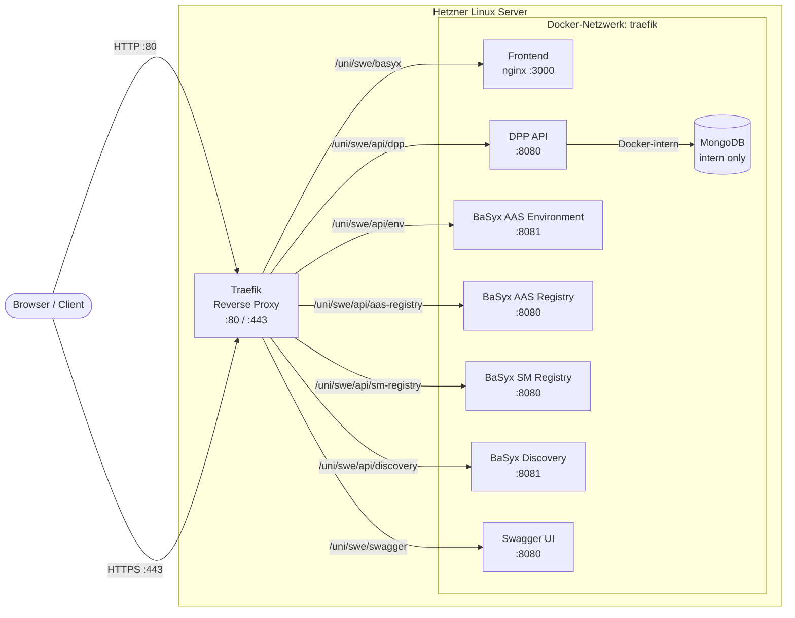
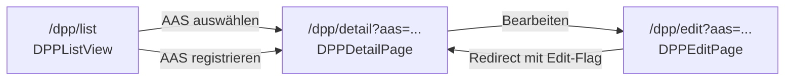

# Moduldokumentation – Routing

**Projekt:** `dpp-frontend` und `dpp-backend`  
**Sprache / Framework:** Traefik Reverse-Proxy, Vue Router (Frontend)  
**Stand:** Mai 2026

---

## Inhaltsverzeichnis

1. [Systemübersicht & Architektur](#1-systemübersicht--architektur)
   - [1.1 Architekturüberblick](#11-architekturüberblick)
   - [1.2 TLS & HTTPS-Terminierung](#12-tls--https-terminierung)
2. [Initiales Service-Routing](#2-initiales-service-routing)
   - [2.0 Traefik-Middleware-Konzepte](#20-traefik-middleware-konzepte)
   - [2.1 Frontend Service-Routing](#21-frontend-service-routing)
   - [2.2 Backend Service-Routing](#22-backend-service-routing)
     - [2.2.1 BaSyx: AAS Environment API](#221-basyx-aas-environment-api)
     - [2.2.2 BaSyx: AAS Registry API](#222-basyx-aas-registry-api)
     - [2.2.3 BaSyx: Submodel Registry API](#223-basyx-submodel-registry-api)
     - [2.2.4 BaSyx: AAS Discovery API](#224-basyx-aas-discovery-api)
     - [2.2.5 DPP: DPP API](#225-dpp-dpp-api)
     - [2.2.6 MongoDB](#226-mongodb)
   - [2.3 Swagger UI](#23-swagger-ui)
3. [Endpunkt-spezifisches Routing](#3-endpunkt-spezifisches-routing)
   - [3.1 Frontend Page-Routing](#31-frontend-page-routing)
   - [3.2 Backend Endpunkt-Routing](#32-backend-endpunkt-routing)

---

## 1. Systemübersicht & Architektur

### 1.1 Architekturüberblick

Alle öffentlich erreichbaren Dienste des Projekts werden über einen einzelnen **Traefik Reverse-Proxy** exponiert. Traefik läuft als Docker-Container auf einem Linux-Server (Hetzner) und fungiert als zentraler Einstiegspunkt für alle eingehenden HTTP- und HTTPS-Anfragen. Die Dienstkonfiguration erfolgt vollständig über **Docker-Labels** direkt in der `docker-compose.yml` – ein separates Traefik-Konfigurations-File ist nicht erforderlich.

Die nachfolgende Grafik zeigt den vollständigen Routing-Pfad vom Client bis zu den einzelnen Backend-Containern:



Alle Dienste befinden sich im gemeinsamen Docker-Netzwerk `traefik`, über welches Traefik die Container direkt per Container-Name erreicht. MongoDB ist ausschließlich über dieses interne Netzwerk erreichbar und besitzt keinen öffentlichen Routing-Eintrag.

### 1.2 TLS & HTTPS-Terminierung

TLS wird zentral durch Traefik terminiert. Zertifikate werden automatisch via **Let's Encrypt** (`certresolver=letsencrypt`) für die Domain `srv01.noah-becker.de` bezogen und erneuert. Alle HTTPS-Router verwenden den Entrypoint `websecure` (Port 443). Für das Frontend ist zusätzlich ein expliziter HTTP→HTTPS-Redirect konfiguriert (Middleware `https-redirect`), sodass HTTP-Anfragen auf Port 80 transparent auf HTTPS umgeleitet werden.

---

## 2. Initiales Service-Routing

### 2.0 Traefik-Middleware-Konzepte

In diesem Projekt werden zwei Middleware-Typen eingesetzt:

**Strip-Prefix-Middleware:** Da alle Dienste unter einem gemeinsamen Pfad-Präfix (`/uni/swe/...`) erreichbar sind, der Präfix aber intern nicht Teil der API-Pfade der Container ist, muss Traefik diesen Präfix vor der Weiterleitung entfernen. Jeder Backend-Dienst definiert eine eigene `stripprefix`-Middleware, die den jeweiligen Präfix aus der URL herausschneidet. Das Frontend bildet dabei die Ausnahme: nginx ist so konfiguriert, dass es den Basispfad versteht, weshalb kein Strip-Prefix nötig ist.

**HTTPS-Redirect-Middleware:** Für den Frontend-Dienst ist ein dedizierter HTTP-Router (`swe-basyx-ui-redirect`) konfiguriert, der eingehende HTTP-Anfragen über die globale Middleware `https-redirect` auf HTTPS umleitet.

### 2.1 Frontend Service-Routing

Das Frontend (Vue.js SPA) wird innerhalb des Containers durch **nginx** auf Port 3000 ausgeliefert. Traefik leitet Anfragen mit dem Präfix `/uni/swe/basyx` direkt an diesen Port weiter – ohne Strip-Prefix, da nginx den Basispfad in seiner Konfiguration kennt.

| Parameter | Wert |
|---|---|
| Öffentliche URL | `https://srv01.noah-becker.de/uni/swe/basyx/` |
| Router-Regel | `Host('srv01.noah-becker.de') && PathPrefix('/uni/swe/basyx')` |
| Entrypoints | `web` (HTTP→HTTPS Redirect), `websecure` (HTTPS) |
| Ziel-Port (Container) | `3000` (nginx) |
| Strip-Prefix | Nein |
| TLS | Let's Encrypt |

```yaml
labels:
  - "traefik.http.routers.swe-basyx-ui.rule=Host(`srv01.noah-becker.de`) && PathPrefix(`/uni/swe/basyx`)"
  - "traefik.http.routers.swe-basyx-ui.entrypoints=websecure"
  - "traefik.http.routers.swe-basyx-ui.tls.certresolver=letsencrypt"
  - "traefik.http.routers.swe-basyx-ui-redirect.rule=Host(`srv01.noah-becker.de`) && PathPrefix(`/uni/swe/basyx`)"
  - "traefik.http.routers.swe-basyx-ui-redirect.entrypoints=web"
  - "traefik.http.routers.swe-basyx-ui-redirect.middlewares=https-redirect"
  - "traefik.http.services.swe-basyx-ui.loadbalancer.server.port=3000"
```

### 2.2 Backend Service-Routing

Alle Backend-Dienste verwenden eine **Strip-Prefix-Middleware**, da ihre internen APIs keine Kenntnis des öffentlichen URL-Präfixes besitzen. Traefik entfernt den Präfix vor der Weiterleitung, sodass der Container ausschließlich den eigentlichen API-Pfad empfängt.

#### 2.2.1 BaSyx: AAS Environment API

| Parameter | Wert |
|---|---|
| Öffentliche URL | `https://srv01.noah-becker.de/uni/swe/api/env/` |
| Router-Name | `basyx-env` |
| Strip-Prefix | `/uni/swe/api/env` |
| Ziel-Port (Container) | `8081` |

```yaml
labels:
  - "traefik.http.routers.basyx-env.rule=Host(`srv01.noah-becker.de`) && PathPrefix(`/uni/swe/api/env`)"
  - "traefik.http.routers.basyx-env.entrypoints=websecure"
  - "traefik.http.routers.basyx-env.tls.certresolver=letsencrypt"
  - "traefik.http.middlewares.basyx-env-strip.stripprefix.prefixes=/uni/swe/api/env"
  - "traefik.http.routers.basyx-env.middlewares=basyx-env-strip@docker"
  - "traefik.http.services.basyx-env.loadbalancer.server.port=8081"
```

#### 2.2.2 BaSyx: AAS Registry API

| Parameter | Wert |
|---|---|
| Öffentliche URL | `https://srv01.noah-becker.de/uni/swe/api/aas-registry/` |
| Router-Name | `basyx-aas-registry` |
| Strip-Prefix | `/uni/swe/api/aas-registry` |
| Ziel-Port (Container) | `8080` |

```yaml
labels:
  - "traefik.http.routers.basyx-aas-registry.rule=Host(`srv01.noah-becker.de`) && PathPrefix(`/uni/swe/api/aas-registry`)"
  - "traefik.http.routers.basyx-aas-registry.entrypoints=websecure"
  - "traefik.http.routers.basyx-aas-registry.tls.certresolver=letsencrypt"
  - "traefik.http.middlewares.basyx-aas-registry-strip.stripprefix.prefixes=/uni/swe/api/aas-registry"
  - "traefik.http.routers.basyx-aas-registry.middlewares=basyx-aas-registry-strip@docker"
  - "traefik.http.services.basyx-aas-registry.loadbalancer.server.port=8080"
```

#### 2.2.3 BaSyx: Submodel Registry API

| Parameter | Wert |
|---|---|
| Öffentliche URL | `https://srv01.noah-becker.de/uni/swe/api/sm-registry/` |
| Router-Name | `basyx-sm-registry` |
| Strip-Prefix | `/uni/swe/api/sm-registry` |
| Ziel-Port (Container) | `8080` |

```yaml
labels:
  - "traefik.http.routers.basyx-sm-registry.rule=Host(`srv01.noah-becker.de`) && PathPrefix(`/uni/swe/api/sm-registry`)"
  - "traefik.http.routers.basyx-sm-registry.entrypoints=websecure"
  - "traefik.http.routers.basyx-sm-registry.tls.certresolver=letsencrypt"
  - "traefik.http.middlewares.basyx-sm-registry-strip.stripprefix.prefixes=/uni/swe/api/sm-registry"
  - "traefik.http.routers.basyx-sm-registry.middlewares=basyx-sm-registry-strip@docker"
  - "traefik.http.services.basyx-sm-registry.loadbalancer.server.port=8080"
```

#### 2.2.4 BaSyx: AAS Discovery API

| Parameter | Wert |
|---|---|
| Öffentliche URL | `https://srv01.noah-becker.de/uni/swe/api/discovery/` |
| Router-Name | `basyx-discovery` |
| Strip-Prefix | `/uni/swe/api/discovery` |
| Ziel-Port (Container) | `8081` |

```yaml
labels:
  - "traefik.http.routers.basyx-discovery.rule=Host(`srv01.noah-becker.de`) && PathPrefix(`/uni/swe/api/discovery`)"
  - "traefik.http.routers.basyx-discovery.entrypoints=websecure"
  - "traefik.http.routers.basyx-discovery.tls.certresolver=letsencrypt"
  - "traefik.http.middlewares.basyx-discovery-strip.stripprefix.prefixes=/uni/swe/api/discovery"
  - "traefik.http.routers.basyx-discovery.middlewares=basyx-discovery-strip@docker"
  - "traefik.http.services.basyx-discovery.loadbalancer.server.port=8081"
```

#### 2.2.5 DPP: DPP API

| Parameter | Wert |
|---|---|
| Öffentliche URL | `https://srv01.noah-becker.de/uni/swe/api/dpp/` |
| Router-Name | `basyx-dpp-api` |
| Strip-Prefix | `/uni/swe/api/dpp` |
| Ziel-Port (Container) | `8080` |

```yaml
labels:
  - "traefik.http.routers.basyx-dpp-api.rule=Host(`srv01.noah-becker.de`) && PathPrefix(`/uni/swe/api/dpp`)"
  - "traefik.http.routers.basyx-dpp-api.entrypoints=websecure"
  - "traefik.http.routers.basyx-dpp-api.tls.certresolver=letsencrypt"
  - "traefik.http.middlewares.basyx-dpp-api-strip.stripprefix.prefixes=/uni/swe/api/dpp"
  - "traefik.http.routers.basyx-dpp-api.middlewares=basyx-dpp-api-strip@docker"
  - "traefik.http.services.basyx-dpp-api.loadbalancer.server.port=8080"
```

> **Hinweis:** Das endpunkt-spezifische Routing der DPP API – also die einzelnen REST-Endpunkte und deren Bedeutung – wird in einem separaten MOD-Dokument behandelt. Die Verlinkung folgt.

#### 2.2.6 MongoDB

MongoDB wird **nicht öffentlich exponiert** und besitzt daher keinen Traefik-Router-Eintrag. Der Dienst ist ausschließlich über das interne Docker-Netzwerk erreichbar und wird vom DPP API-Container direkt per Hostname angesprochen. Ein öffentliches Hosting ist aus Sicherheitsgründen bewusst nicht vorgesehen.

### 2.3 Swagger UI

Zusätzlich zu den eigentlichen Diensten wird eine **Swagger UI** Instanz gehostet, über die API-Dokumentationen interaktiv eingesehen werden können.

| Parameter | Wert |
|---|---|
| Öffentliche URL | `https://srv01.noah-becker.de/uni/swe/swagger/` |
| Router-Name | `swe-swagger` |
| Strip-Prefix | `/uni/swe/swagger` |
| Ziel-Port (Container) | `8080` |

```yaml
labels:
  - "traefik.http.routers.swe-swagger.rule=Host(`srv01.noah-becker.de`) && PathPrefix(`/uni/swe/swagger`)"
  - "traefik.http.routers.swe-swagger.entrypoints=websecure"
  - "traefik.http.routers.swe-swagger.tls.certresolver=letsencrypt"
  - "traefik.http.middlewares.swe-swagger-stripprefix.stripprefix.prefixes=/uni/swe/swagger"
  - "traefik.http.routers.swe-swagger.middlewares=swe-swagger-stripprefix@docker"
  - "traefik.http.services.swe-swagger.loadbalancer.server.port=8080"
```

---

## 3. Endpunkt-spezifisches Routing

### 3.1 Frontend Page-Routing

Das Frontend ist als **Vue.js Single-Page-Application (SPA)** implementiert und nutzt den **Vue Router** mit HTML5-History-Modus (`createWebHistory`). Das Routing findet vollständig client-seitig statt – Traefik leitet alle Anfragen unter `/uni/swe/basyx` an nginx weiter, nginx liefert stets `index.html` aus, und der Vue Router übernimmt die Auflösung des Pfades im Browser.

Die projektspezifisch implementierten Seiten sind die folgenden DPP-Seiten:

| Pfad | Route-Name | Komponente | Beschreibung |
|---|---|---|---|
| `/dpp/list` | `DPPListView` | `DPPListView` | Auflistung aller AAS mit und ohne registriertem DPP; Möglichkeit zur Registrierung einer AAS als DPP |
| `/dpp/detail` | `DPPDetailPage` | `DPPDetailPage` | DPP-Detailansicht mit allen relevanten Submodels; AAS wird per Query-Parameter `?aas=...` übergeben |
| `/dpp/edit` | `DPPEditPage` | `DPPEditPage` | Bearbeitungsansicht eines DPP; leitet intern auf `DPPDetailPage` mit gesetztem Bearbeitungs-Flag weiter; AAS wird per Query-Parameter `?aas=...` übergeben |

Die Navigationsbeziehungen zwischen den DPP-Seiten lassen sich wie folgt darstellen:



### 3.2 Backend Endpunkt-Routing

Die BaSyx-Dienste (AAS Environment, AAS Registry, Submodel Registry, AAS Discovery) implementieren die standardisierten **AAS API-Spezifikationen** gemäß der Asset Administration Shell Part 2-Norm (IDTA). Die konkreten Endpunkte dieser Dienste sind daher nicht projektspezifisch und werden in der offiziellen BaSyx-Dokumentation beschrieben.

Das endpunkt-spezifische Routing der **DPP API** – alle REST-Endpunkte, HTTP-Methoden, Request-/Response-Strukturen und deren fachliche Bedeutung – wird in einem separaten MOD-Dokument behandelt. *(Verlinkung folgt.)*
