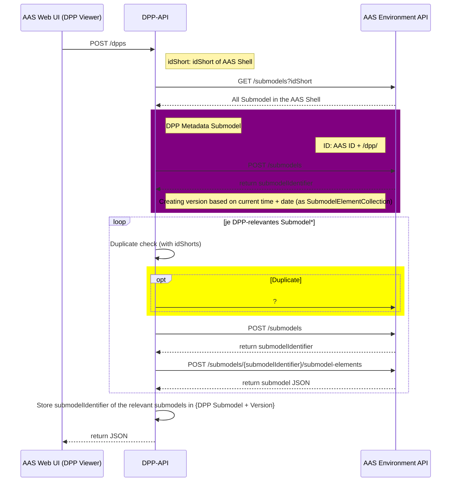
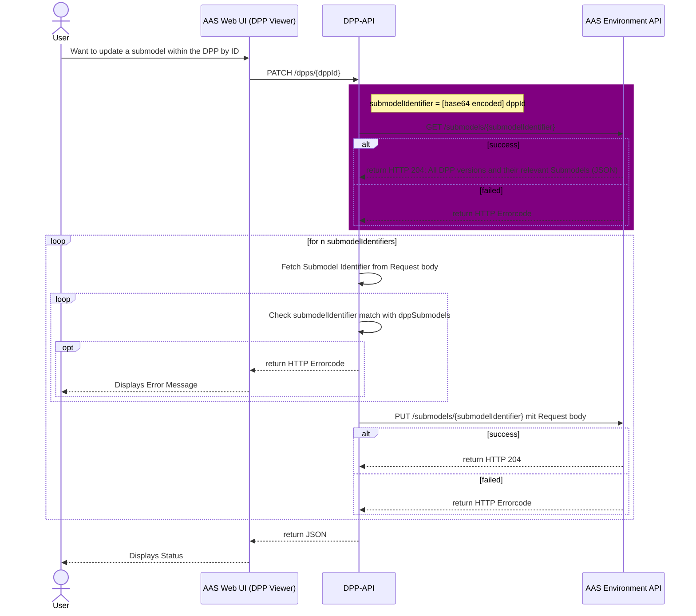
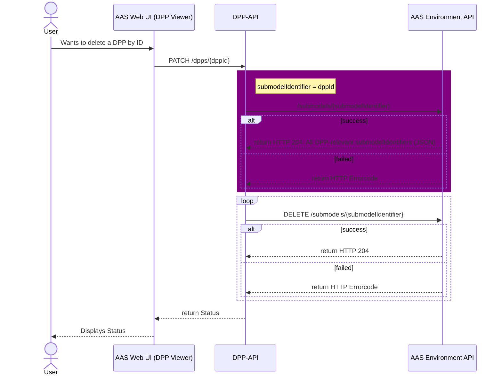
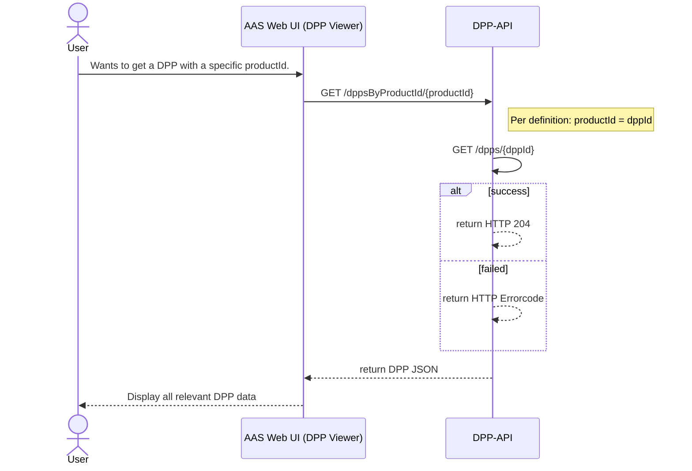
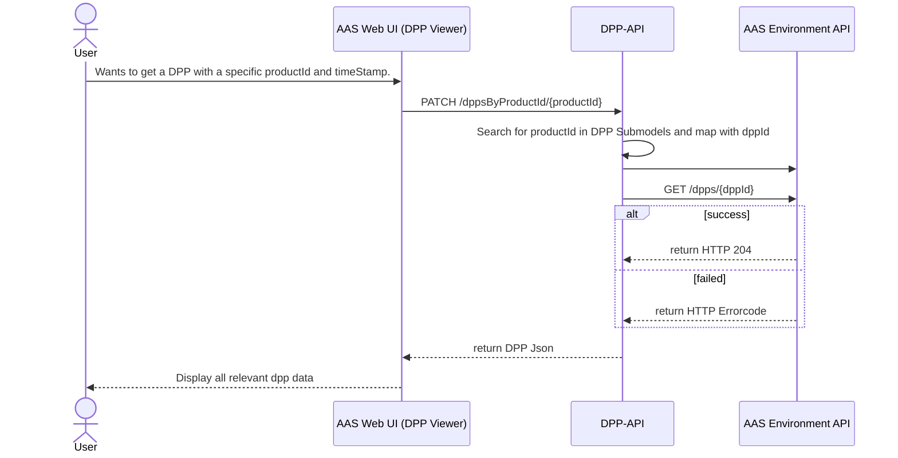
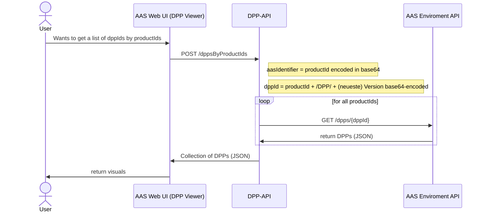
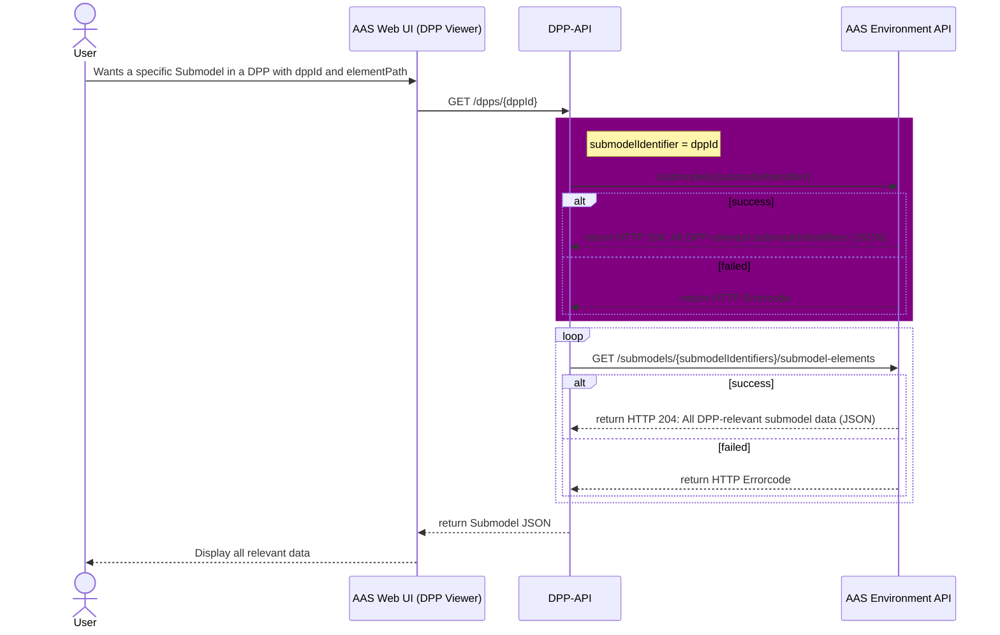

# DPP API Call-mappings

Dieses Dokument dient der Nachvollziehbarkeit der internen DPP API Abläufe, insbesondere den genutzten internen API Endpunkten der AAS Environment API, wie die Eingabeparameter auf bestehende Parameter der AAS Environment API gemapped werden und wie diese Rückgaben intern auf die von der DIN18222-Norm geforderten Rückgabeparameter gemapped werden.

 

| Version | Datum      | Autoren                    |
|---------|------------|----------------------------|
| 1.0     | 2025-11-08 | Luca Schmoll & Noah Becker |

---

## DPP Life Cycle API

*Hauptmethoden zur Verwaltung des DPP-Lebenszyklus*  
 

### `POST` /dpps

 

### `GET` /dpps/{dppId}

[KI example](https://mermaid.live/edit#pako:eNqVVclu2zAQ_ZUBTwmgeJO8RGhTZLELX1KjLnJoHAS0SMesJVElKceu4X_vaLPltakOAjV8b97McIZaEU8yTlyi-e-Yhx5_EPRN0WAUAj4RVUZ4IqKhgXtf8NAc2m8HfaAaelSbZNkNWSTFMWA3TKRUAr6jmrecwnIIfZDeLEPmqyFXc-HxDJm9s3iubm5Q1YWv3R9QZVGkv-Crzz4vFosMhruIyZXcXBJSUAbIt64KTzz9Zq8lSNlTFlAuqONxgGBfV1c7tHXGyLAbz9-5jmSoObwLM4WC2_V5gIno55ey2KM0HOQcU0-pA6qQpwoH2qjYM7Hin8aqenNh1BIYNbSy79OCQ4vEuipFl5dlOV_KCHq4xak3heEu6V76PveMkGEGPhJfd2EU9fDgBoMnrjRCwYiAa0ODaEuivoEn6gu23YSJjEO2hZzMvT_8Bp1WrQ5VmFDfH1NvhlwVUHOW3BMhS6IqUtLgHclmW4ji2S1IUUXoP4AId_zt0k53XMnFIeVUDxakV8EOSaeU_9WhJafrzf4VzxvkIzrJOfa4SQvjeVzrSewfoo5MQFG1tFuPM_bO75YxWAlmpYw1GLkp5GZgyg-aeR7ahAqfsw-F1VVKqv8LhyeUD8Sz39sHhrPdexcLP21fmOdTJce_sHnddO5XudHajpNVDme99Z3W5VHCfHf6zooPZyICMxU6CaDkqshgszh6Yw2lMtgofkLWMF6WRv4i5O-4hIlQ2lzuX7F4KNnV7sIqOXQXniuVyouFgxsnxnBNLPKmBCMu3oLcIgHHWyD5JKvEy4iYKbbyiLi4ZFTNRmSUcvDP8lPKoKApGb9NiYuXicavOEKt4ue3gWCKXN0nusTttBqpD-KuyIK4jbZdaTfqdqdds22n7tRsiyyJ67Qrtt1qNq_bDcdp1R1nbZE_qWq9YjdqzXan6didVvu6XnfWfwEHPUAO)

 

%% rework tbd

### `PATCH` /dpps/{dppId}

 

### `DELETE` /dpps/{dppId}

 

### `GET` /dppsByProductId/{productId}

 

### `GET` /dppsByProductIdAndDate/{productId}

 

### `POST` /dppsByProductIds

 

---

## DPP Registry API

### `POST` /registerDPP

 

---

## DPP Fine-Granular Life Cycle API

### `GET` /dpps/{dppId}/collections/{elementId}

 

### `PATCH` /dpps/{dppId}/collections/{elementId}

 

### `GET` /dpps/{dppId}/elements/{elementPath}

 

### `PATCH` /dpps/{dppId}/elements/{elementPath}
