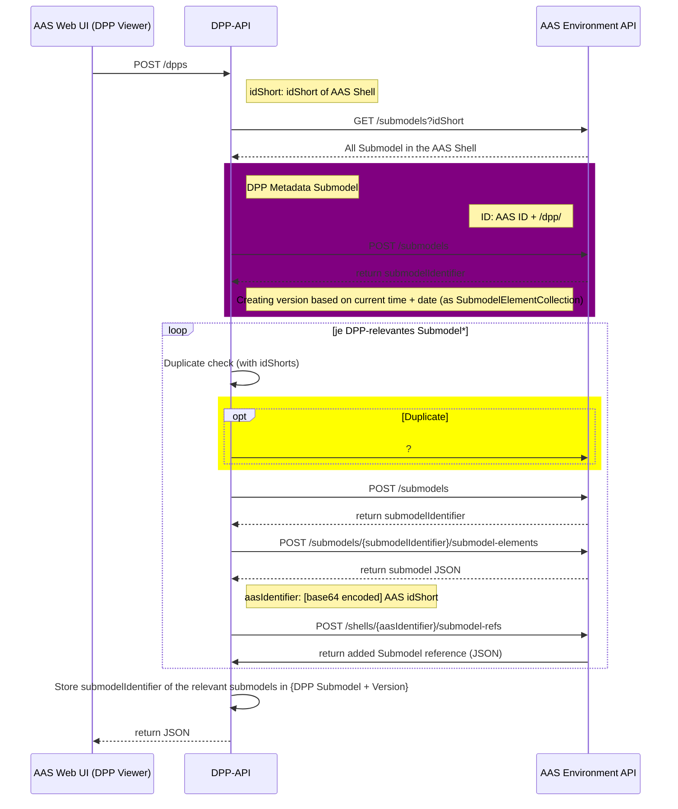
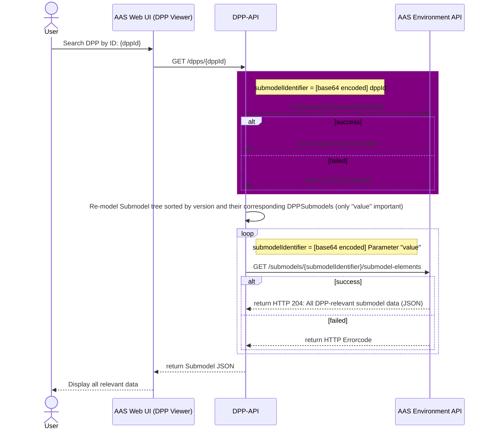
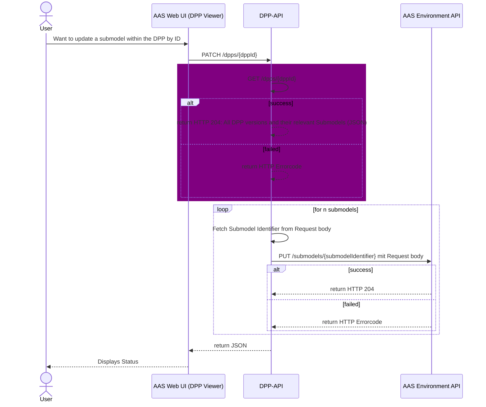
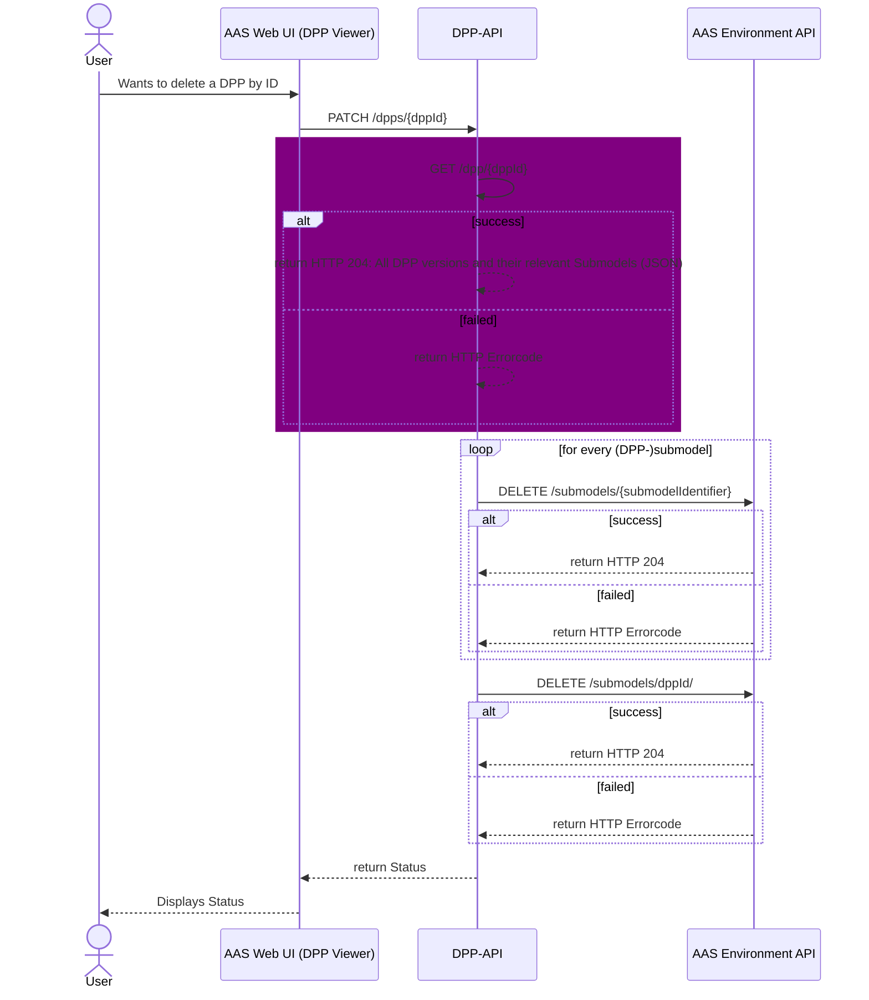
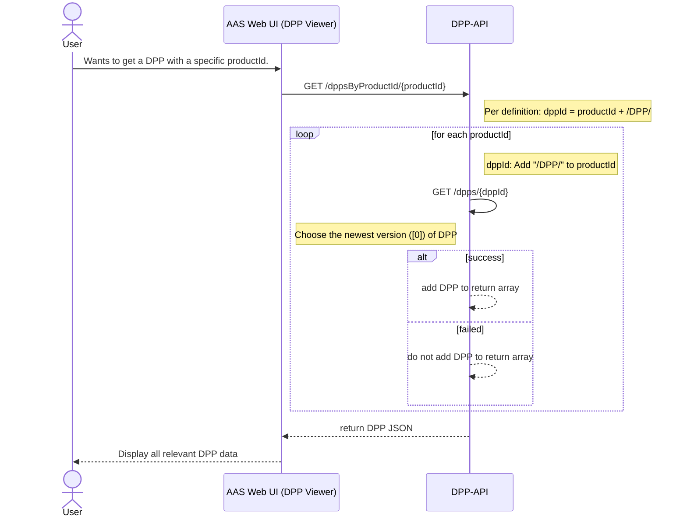
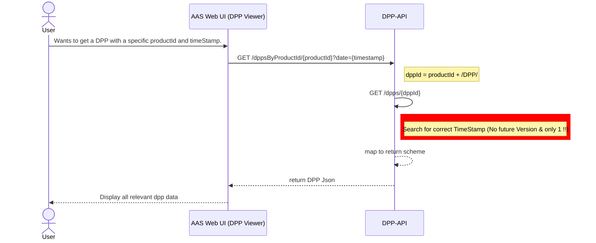
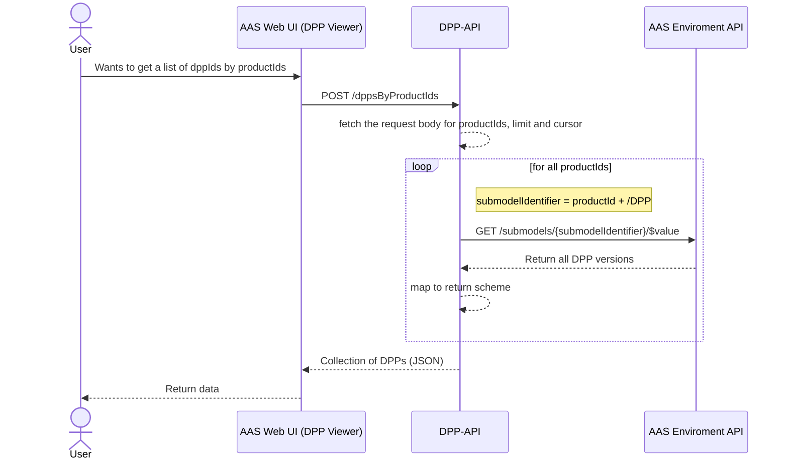
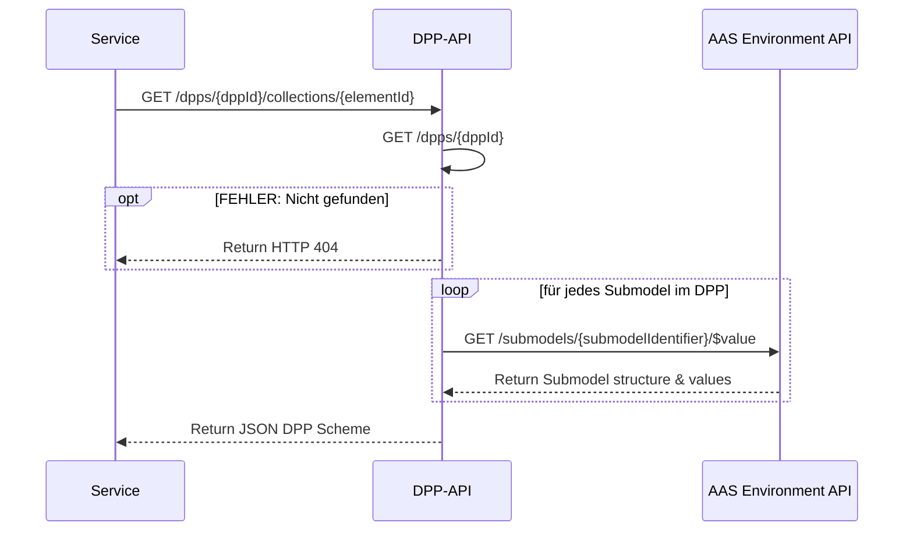
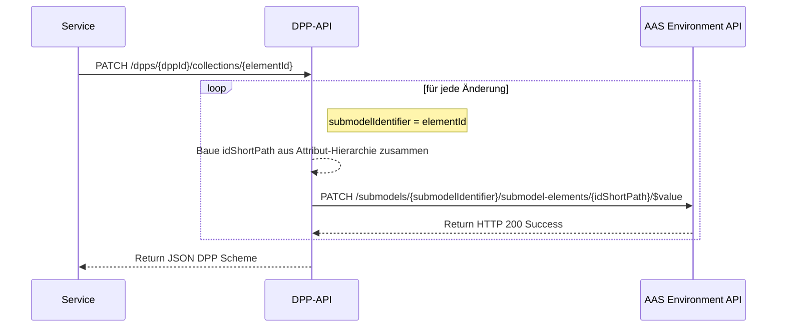

# DPP API Call-mappings

Dieses Dokument dient der Nachvollziehbarkeit der internen DPP API Abläufe, insbesondere den genutzten internen API Endpunkten der AAS Environment API, wie die Eingabeparameter auf bestehende Parameter der AAS Environment API gemapped werden und wie diese Rückgaben intern auf die von der DIN18222-Norm geforderten Rückgabeparameter gemapped werden.

 

| Version | Datum      | Autoren                    | Bemerkung |
|---------|------------|----------------------------|-----------|
| 1.0     | 2025-11-08 | Luca Schmoll & Noah Becker | Inital thoughts & diagrams |
| 1.1     | 2025-11-09 | Luca Schmoll & Noah Becker | Refactor sequences & write down open questions |
| 1.2     | 2025-11-12 | Noah Becker                | Refactor Fine-Granular API Calls |

---

## DPP Life Cycle API

*Hauptmethoden zur Verwaltung des DPP-Lebenszyklus*  
 

### `POST` /dpps

> DIN Dokument hier ungenau: Tabelle 5 &mdash; Create DPP gibt als Ausgabeparameter `dppId` an, während Tabelle 17 &mdash; Lebensweg-API als Ausgabe `DPP`(-Objekt) fordert.

 

**Erläuterung**  

| **Actor**      | **API-Call** | **Recipient** | **Parameters** | **Body expected?** | **Return element** | **Note** |
|----------------|--------------|---------------|----------------|--------------------|--------------------|----------|
| **AAS Web UI** | `POST` /dpps | DPP-API | - | *Yes*   dppId   productId^*^ | JSON | Initial Frontend call   dppId can be empty   productId has to be idShort of AAS Shell   *Both base64-encoded!*   **Return: JSON** |
| **DPP-API**    | `GET` /submodels | Environment API | idShort | No | JSON | idShort is productId   **Return: Array of submodels** |
|                | `POST` /submodels | Environment API | 

 

### `GET` /dpps/{dppId}

[KI example](https://mermaid.live/edit#pako:eNqVVclu2zAQ_ZUBTwmgeJO8RGhTZLELX1KjLnJoHAS0SMesJVElKceu4X_vaLPltakOAjV8b97McIZaEU8yTlyi-e-Yhx5_EPRN0WAUAj4RVUZ4IqKhgXtf8NAc2m8HfaAaelSbZNkNWSTFMWA3TKRUAr6jmrecwnIIfZDeLEPmqyFXc-HxDJm9s3iubm5Q1YWv3R9QZVGkv-Crzz4vFosMhruIyZXcXBJSUAbIt64KTzz9Zq8lSNlTFlAuqONxgGBfV1c7tHXGyLAbz9-5jmSoObwLM4WC2_V5gIno55ey2KM0HOQcU0-pA6qQpwoH2qjYM7Hin8aqenNh1BIYNbSy79OCQ4vEuipFl5dlOV_KCHq4xak3heEu6V76PveMkGEGPhJfd2EU9fDgBoMnrjRCwYiAa0ODaEuivoEn6gu23YSJjEO2hZzMvT_8Bp1WrQ5VmFDfH1NvhlwVUHOW3BMhS6IqUtLgHclmW4ji2S1IUUXoP4AId_zt0k53XMnFIeVUDxakV8EOSaeU_9WhJafrzf4VzxvkIzrJOfa4SQvjeVzrSewfoo5MQFG1tFuPM_bO75YxWAlmpYw1GLkp5GZgyg-aeR7ahAqfsw-F1VVKqv8LhyeUD8Sz39sHhrPdexcLP21fmOdTJce_sHnddO5XudHajpNVDme99Z3W5VHCfHf6zooPZyICMxU6CaDkqshgszh6Yw2lMtgofkLWMF6WRv4i5O-4hIlQ2lzuX7F4KNnV7sIqOXQXniuVyouFgxsnxnBNLPKmBCMu3oLcIgHHWyD5JKvEy4iYKbbyiLi4ZFTNRmSUcvDP8lPKoKApGb9NiYuXicavOEKt4ue3gWCKXN0nusTttBqpD-KuyIK4jbZdaTfqdqdds22n7tRsiyyJ67Qrtt1qNq_bDcdp1R1nbZE_qWq9YjdqzXan6didVvu6XnfWfwEHPUAO)

 

### `PATCH` /dpps/{dppId}

> Zu klären: Soll hier der timestamp geändert werden?

 

### `DELETE` /dpps/{dppId}

 

### `GET` /dppsByProductId/{productId}

 

### `GET` /dppsByProductIdAndDate/{productId}?date={timestamp}

 

| **Input-Parameter** | **Description** | **Format** | **Note** |
|---------------------|-----------------|------------|----------|
| **productId**       | Product-ID      | *base64-encoded* | submodelIdentifier of (Product) AAS   |
| **timestamp**       | Timestamp       | YYYY-MM-DD*T*HH-MM-SS*Z* | - |

| **API-Call** | **Parameter** | **Return** | **Note** |
|--------------|---------------|------------|----------|
| **GET /dpp/{dppId}** | dppId | [See here](#api-calls) | dppId = *productId* + *"DPP"*   productId is *base64*-encoded and needs to be decoded in order to generate submodelIdentifier for DPP |
| **GET /dppsByProductIdAndDate/{productId}?date={timestamp}** | productId   timestamp |  | Only return the to the given timestamp newest DPP, no older or newer DPPs(!) |

 

### `POST` /dppsByProductIds

> Nochmal Blick in die Norm werfen – insbesondere für die Umsetzung der Parameter *limit* und *cursor*

 

| **Input-Parameter** | **Description** | **Format** | **Note** |
|---------------------|-----------------|------------|----------|
| **Request body** *productIds limit cursor* |   Product-ID   .   . |   *base64-encoded*   ?   ? |   submodelIdentifier of (Product) AAS   ?   ? |

| **API-Call** | **Parameter** | **Return** | **Note** |
|--------------|---------------|------------|----------|
| **GET /submodels/{submodelIdentifier}/$value** | submodelIdentifier | [See here](#api-calls) | submodelIdentifier is put together by the given *productId* and *"/DPP"* |
| **GET /dppsByProductIds** | Request body: *productIds limit cursor* |  | productId is *base64*-encoded and needs to be decoded in order to generate submodelIdentifier for DPP |

 

---

## DPP Registry API

### `POST` /registerDPP

 

---

## DPP Fine-Granular Life Cycle API

### `GET` /dpps/{dppId}/collections/{elementId}

 

### `PATCH` /dpps/{dppId}/collections/{elementId}

> **To be included:** "Wenn die Aktualisierung einiger Teile scheitert, scheitert der vollständige Aktualisierungsprozess
und es sollten keine Änderungen im DPP übernommen werden."

 

### `GET` /dpps/{dppId}/elements/{elementPath}

 

| **Input-Parameter** | **Description** |**Format** | **Note** |
|---------------------|-----------------|-----------|----------|
| dppId               | [See here](#parameter) | - | - |
| elementPath         | ElementId path to the specific data element | *idShort[Submodel]*.*idShort[ChildrenElement]*.[...] | Hierachic structure - start from idShort of submodel to end with specific submodel entry - divided by dots |

| **API-Call** | **Parameter** | **Return** | **Note** |
|--------------|---------------|------------|----------|
| **GET /dpps/{dppId}** | dppId | [See here](#api-calls) | - |
| **GET /submodels/{submodelIdentifier}/submodel-elements/{idShortPath}/$value** | submodelIdentifier   idShortPath | [See here](#api-calls) | Use submodelIdentifier from *GET /dpps/{dppId}*;   Retrieve idShortPath from input parameter *elementPath* - divided by dots, use path given from elementPath[1] |

 

### `PATCH` /dpps/{dppId}/elements/{elementPath}

> **tbd**

 

---

## Important parameter & API Calls

### Parameter

| **Parameter** | **Description** | **Format** | **Note** |
|---------------|-----------------|------------|----------|
| **dppId**     | DPP identifer   | *submodelIdentifier* + "/DPP/" + timestamp | Used to identify a specific (versioned) DPP |

 

### API Calls

| **API-Call** | **Parameter** | **Return** | **Note** |
|--------------|---------------|------------|----------|
| **GET /ddps/{dppId}** | dppId | <code>{ &nbsp;&nbsp;"status": "Success", &nbsp;&nbsp;"payload": {   &nbsp;&nbsp;&nbsp;&nbsp; "dppId": "[base64-encoded dppId]",   &nbsp;&nbsp;&nbsp;&nbsp; "timestamp": "YYYY-MM-DDTHH-MM-SSZ"   &nbsp;&nbsp;&nbsp;&nbsp; "dpps": [   &nbsp;&nbsp;&nbsp;&nbsp;&nbsp; {   &nbsp;&nbsp;&nbsp;&nbsp;&nbsp;&nbsp; DPPVersion: "YYYY-MM-DDTHH-MM-SSZ",   &nbsp;&nbsp;&nbsp;&nbsp;&nbsp;&nbsp; "DPPSubmodels": {   &nbsp;&nbsp;&nbsp;&nbsp;&nbsp;&nbsp;&nbsp;&nbsp; "DPPSubmodel_[submodelshortId]": "[submodelIdentifier]",   &nbsp;&nbsp;&nbsp;&nbsp;&nbsp;&nbsp;&nbsp;&nbsp; "DPPSubmodel_[submodelshortId]": "[submodelIdentifier]"   &nbsp;&nbsp;&nbsp;&nbsp;&nbsp;&nbsp;&nbsp;}   &nbsp;&nbsp;&nbsp;&nbsp;&nbsp; }   &nbsp;&nbsp;&nbsp;&nbsp;]  &nbsp;&nbsp;}     }</code> | - |
