# DPP API Call-mappings

Dieses Dokument dient der Nachvollziehbarkeit der internen DPP API Abläufe, insbesondere den genutzten internen API Endpunkten der AAS Environment API, wie die Eingabeparameter auf bestehende Parameter der AAS Environment API gemapped werden und wie diese Rückgaben intern auf die von der DIN18222-Norm geforderten Rückgabeparameter gemapped werden.

 

| Version | Datum      | Autoren                    | Bemerkung |
|---------|------------|----------------------------|-----------|
| 1.0     | 2025-11-08 | Luca Schmoll & Noah Becker | Inital thoughts & diagrams |
| 1.1     | 2025-11-09 | Luca Schmoll & Noah Becker | Refactor sequences & write down open questions |
| 1.2     | 2025-11-12 | Noah Becker                | Refactor Fine-Granular API Calls |

---

## DPP Life Cycle API

*Hauptmethoden zur Verwaltung des DPP-Lebenszyklus*  
 

### `POST` /dpps

> ***[noahbecker] 2025-11-10 21:06:*** DIN Dokument hier ungenau: Tabelle 5 &mdash; Create DPP gibt als Ausgabeparameter `dppId` an, während Tabelle 17 &mdash; Lebensweg-API als Ausgabe `DPP`(-Objekt) fordert.

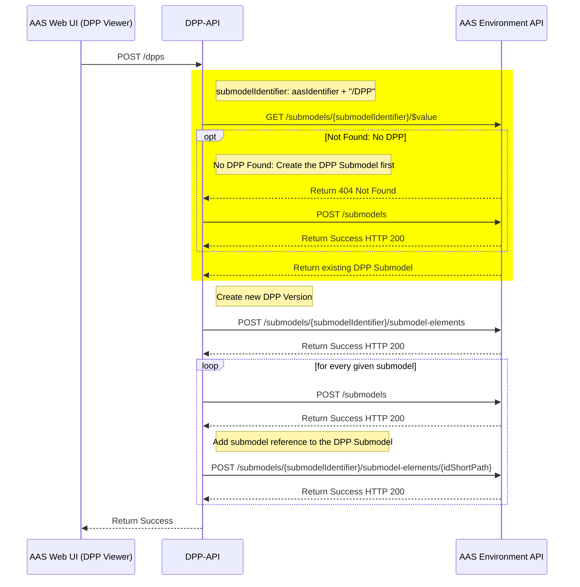

 

| **Input-Parameter** | **Description** | **Format** | **Note** |
|---------------------|-----------------|------------|----------|
| **dppId**           | DPP-Identifier  | *base64-encoded* | [See here](#parameter) |
| **Request body** aasIdentifier dpp |  AAS-Identifier Submodels |  *base64-encoded* [See here](#parameter) | -

| **API-Call** | **Parameter** | **Return** | **Note** |
|--------------|---------------|------------|----------|
| **GET /submodels/{submodelIdentifier}/$value** | submodelIdentifier | [See here](#api-calls) | submodelIdentifier must be build from the given *aasIdentifier* + *"/DPP"* |
| **POST /submodels** | [See here]() | - | 1. Create DPP Submodel   2. Create Submodels |
| **POST /submodels/{submodelIdentifier}/submodel-elements** | submodelIdentifier  *Request body* | - | Parameter *submodelIdentifier* is submodelIdentifier of DPP Submodel |
| **POST /submodels/{submodelIdentifier}/submodel-elements/{idShortPath}** | submodelIdentifier   idShortPath | - | Parameter *submodelIdentifier* is submodelIdentifier of DPP Submodel   idShortPath is build from scheme: "DPPSubmodels.DPPSubmodel_[shortId of Submodel]" |
| | | | |
| **POST /dpps** | - | ***Image soon*** | - |

 

### `GET` /dpps/{dppId}

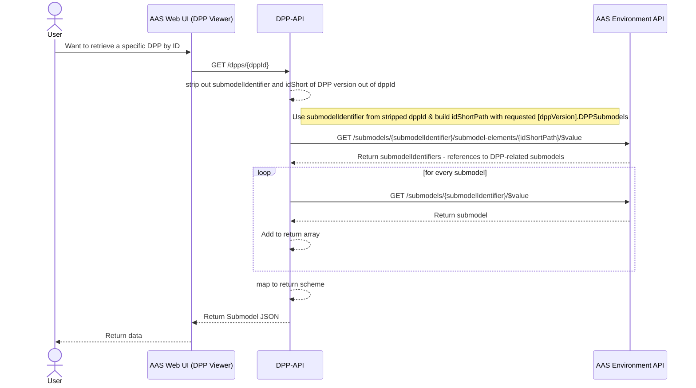

 

| **Input-Parameter** | **Description** | **Format** | **Note** |
|---------------------|-----------------|------------|----------|
| **dppId**           | DPP-Identifier  | *base64-encoded* | [See here](#parameter) |

| **API-Call** | **Parameter** | **Return** | **Note** |
|--------------|---------------|------------|----------|
| **GET /submodels/{submodelIdentifier}/submodel-elements/{idShortPath}/$value** | submodelIdentifier idShortPath | - | submodelIdentifier and idShortPath need to be stripped out of given dppId;   idShortPath has to end with ".DPPSubmodels" |
| **GET /submodels/{submodelIdentifier}/$value** | submodelIdentifier | - | Returns submodel data |
| | | | |
| **GET /dpps/{dppId}** | dppId | ***image soon*** | - |

 

### `PATCH` /dpps/{dppId}

> ***[noahbecker] 2025-11-11:*** Zu klären: Soll hier der timestamp geändert werden?
> ***[noahbecker] 2025-11-13:*** Soll hier das DPP Submodel verändert werden (sprich: Änderungen an den Referenzierungen zu den Submodels) oder konkret die in den DPP verwendeten Submodels verändert werden?

> **To be included:** "Wenn die Aktualisierung einiger Teile scheitert, scheitert der vollständige Aktualisierungsprozess
und es sollten keine Änderungen im DPP übernommen werden."

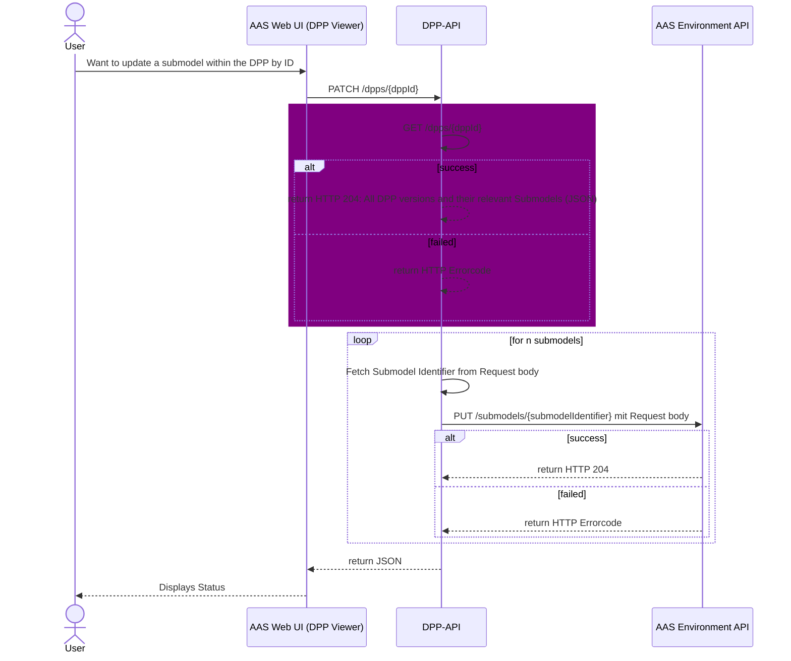

 

### `DELETE` /dpps/{dppId}

> ***[noahbecker] 2025-11-13 11:12:*** Will man hier komplettes DPP inkl. der referenzierten Submodels (Nameplate, Carbon Footprint,...) löschen **oder** nur den DPP an sich?
>> Diagramm zeigt Variante, nur den DPP an sich zu löschen, referenzierte Submodels existieren weiterhin

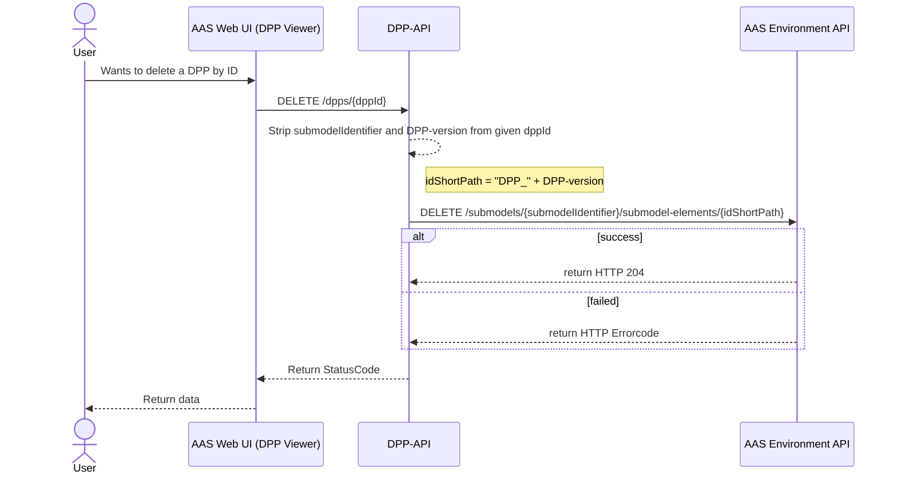

 

| **Input-Parameter** | **Description** | **Format** | **Note** |
|---------------------|-----------------|------------|----------|
| **dppId**           | DPP-Identifier  | *base64-encoded* | [See here](#parameter) |
| **submodelIdentifier** | Submodel-Identifier | *base64-encoded* | submodelIdentifier is stripped out of given dppId |
| **idShortPath**     | Element-ID-Path | "DPP_" + timestamp | Stripped out of given dppId |

| **API-Call** | **Parameter** | **Return** | **Note** |
|--------------|---------------|------------|----------|
| **DELETE /submodels/{submodelIdentifier}/submodel-elements/{idShortPath}** | submodelIdentifier idShortPath | - | submodelIdentifier and idShortPath need to be stripped out of given dppId |
| | | | |
| **DELETE /dpps/{dppId}** | dppId | 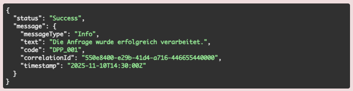 | Only return the to the given timestamp newest DPP, no older or newer DPPs(!) |

 

### `GET` /dppsByProductId/{productId}

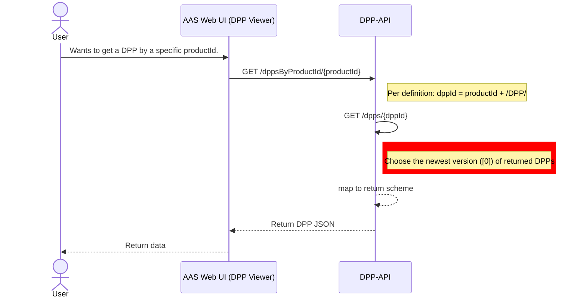

 

| **Input-Parameter** | **Description** | **Format** | **Note** |
|---------------------|-----------------|------------|----------|
| **productId**       | Product-Identifier  | *base64-encoded* | [See here](#parameter) |

| **API-Call** | **Parameter** | **Return** | **Note** |
|--------------|---------------|------------|----------|
| **GET /dpps/{dppId}** | dppId | [See here](#api-calls) | dppId = *productId* + *"DPP"*   productId is *base64*-encoded and needs to be decoded in order to generate submodelIdentifier for DPP |
| | | | |
| **GET /dppsByProductId/{productId}** | productId | 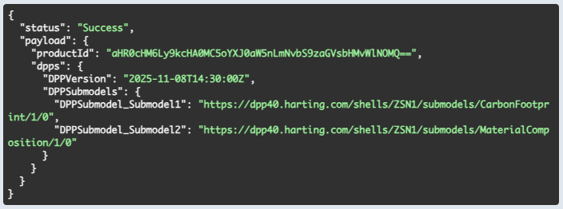 | Only return the newest DPP to the given product(Id) |

 

### `GET` /dppsByProductIdAndDate/{productId}?date={timestamp}

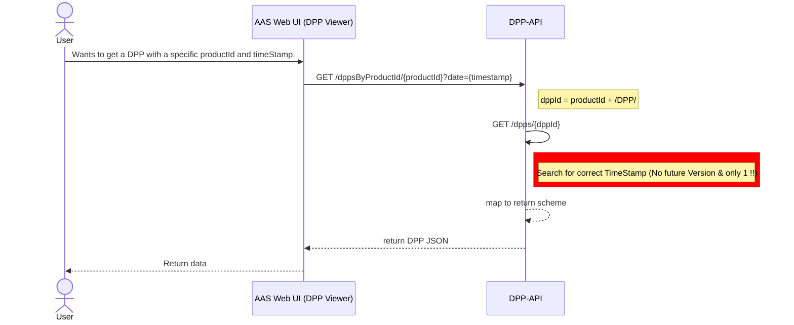

 

| **Input-Parameter** | **Description** | **Format** | **Note** |
|---------------------|-----------------|------------|----------|
| **productId**       | Product-ID      | *base64-encoded* | [See here](#parameter) |
| **timestamp**       | Timestamp       | YYYY-MM-DD*T*HH-MM-SS*Z* | - |

| **API-Call** | **Parameter** | **Return** | **Note** |
|--------------|---------------|------------|----------|
| **GET /dpp/{dppId}** | dppId | [See here](#api-calls) | dppId = *productId* + *"DPP"*   productId is *base64*-encoded and needs to be decoded in order to generate submodelIdentifier for DPP |
| | | | |
| **GET /dppsByProductIdAndDate/{productId}?date={timestamp}** | productId   timestamp | 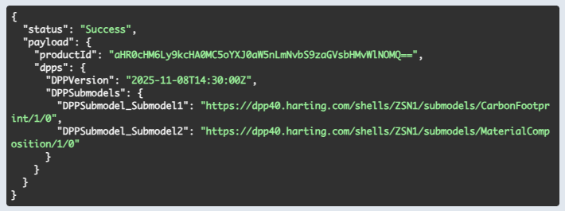 | Only return the to the given timestamp newest DPP, no older or newer DPPs(!) |

 

### `POST` /dppsByProductIds

> Nochmal Blick in die Norm werfen – insbesondere für die Umsetzung der Parameter *limit* und *cursor*

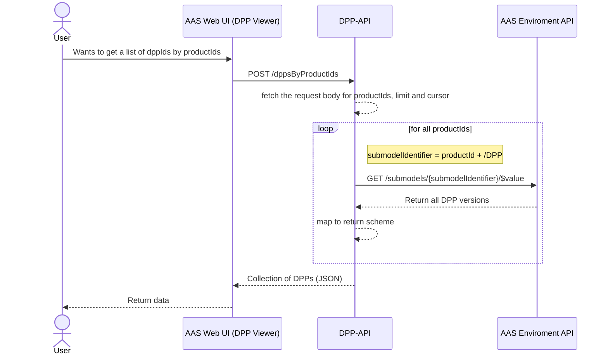

 

| **Input-Parameter** | **Description** | **Format** | **Note** |
|---------------------|-----------------|------------|----------|
| **Request body** *productId limit cursor* |   Product-ID   .   . |   *base64-encoded*   ?   ? |   [See here](#parameter)   ?   ? |

| **API-Call** | **Parameter** | **Return** | **Note** |
|--------------|---------------|------------|----------|
| **GET /submodels/{submodelIdentifier}/$value** | submodelIdentifier | [See here](#api-calls) | submodelIdentifier is put together by the given *productId* and *"/DPP"* |
| | | | |
| **GET /dppsByProductIds** | Request body: *productId limit cursor* | 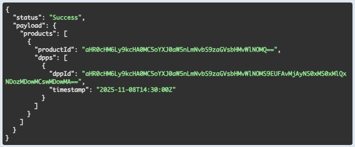 | productId is *base64*-encoded and needs to be decoded in order to generate submodelIdentifier for DPP |

 

---

## DPP Registry API

### `POST` /registerDPP

 

---

## DPP Fine-Granular Life Cycle API

### `GET` /dpps/{dppId}/collections/{elementId}

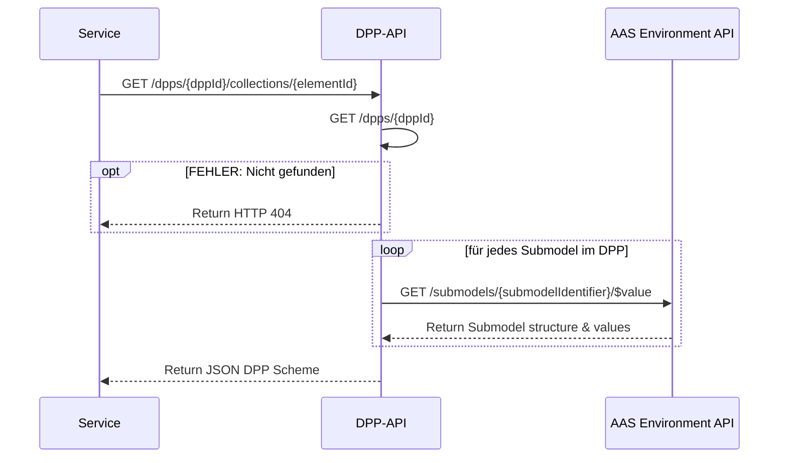

 

### `PATCH` /dpps/{dppId}/collections/{elementId}

> **To be included:** "Wenn die Aktualisierung einiger Teile scheitert, scheitert der vollständige Aktualisierungsprozess
und es sollten keine Änderungen im DPP übernommen werden."

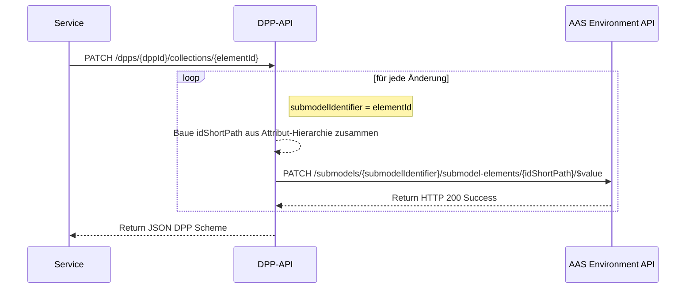

 

### `GET` /dpps/{dppId}/elements/{elementPath}

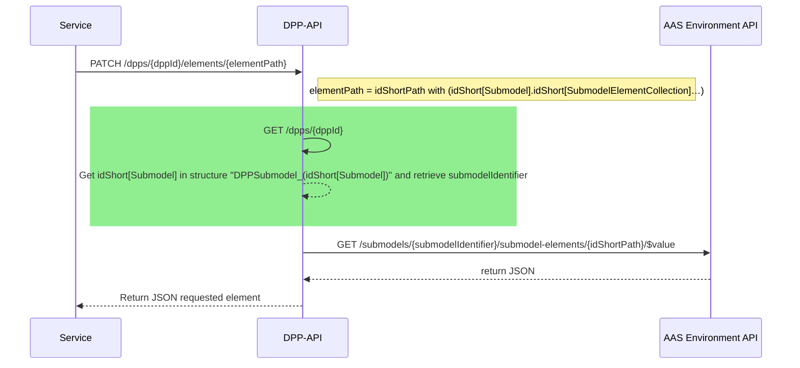

 

| **Input-Parameter** | **Description** |**Format** | **Note** |
|---------------------|-----------------|-----------|----------|
| dppId               | [See here](#parameter) | - | - |
| elementPath         | ElementId path to the specific data element | *idShort[Submodel]*.*idShort[ChildrenElement]*.[...] | Hierachic structure - start from idShort of submodel to end with specific submodel entry - divided by dots |

| **API-Call** | **Parameter** | **Return** | **Note** |
|--------------|---------------|------------|----------|
| **GET /dpps/{dppId}** | dppId | [See here](#api-calls) | - |
| | | | |
| **GET /submodels/{submodelIdentifier}/submodel-elements/{idShortPath}/$value** | submodelIdentifier   idShortPath | [See here](#api-calls) | Use submodelIdentifier from *GET /dpps/{dppId}*;   Retrieve idShortPath from input parameter *elementPath* - divided by dots, use path given from elementPath[1] |

 

### `PATCH` /dpps/{dppId}/elements/{elementPath}

> **tbd**

 

---

## Important parameter & API Calls

### Parameter

| **Parameter** | **Description** | **Format** | **Note** |
|---------------|-----------------|------------|----------|
| **dppId**     | DPP identifer   | *submodelIdentifier* + "/DPP/" + timestamp | Used to identify a specific (versioned) DPP |

 

### API Calls

| **API-Call** | **Parameter** | **Return** | **Note** |
|--------------|---------------|------------|----------|
| **GET /ddps/{dppId}** | dppId | <code>{ &nbsp;&nbsp;"status": "Success", &nbsp;&nbsp;"payload": {   &nbsp;&nbsp;&nbsp;&nbsp; "dppId": "[base64-encoded dppId]",   &nbsp;&nbsp;&nbsp;&nbsp; "timestamp": "YYYY-MM-DDTHH-MM-SSZ"   &nbsp;&nbsp;&nbsp;&nbsp; "dpps": [   &nbsp;&nbsp;&nbsp;&nbsp;&nbsp; {   &nbsp;&nbsp;&nbsp;&nbsp;&nbsp;&nbsp; DPPVersion: "YYYY-MM-DDTHH-MM-SSZ",   &nbsp;&nbsp;&nbsp;&nbsp;&nbsp;&nbsp; "DPPSubmodels": {   &nbsp;&nbsp;&nbsp;&nbsp;&nbsp;&nbsp;&nbsp;&nbsp; "DPPSubmodel_[submodelshortId]": "[submodelIdentifier]",   &nbsp;&nbsp;&nbsp;&nbsp;&nbsp;&nbsp;&nbsp;&nbsp; "DPPSubmodel_[submodelshortId]": "[submodelIdentifier]"   &nbsp;&nbsp;&nbsp;&nbsp;&nbsp;&nbsp;&nbsp;}   &nbsp;&nbsp;&nbsp;&nbsp;&nbsp; }   &nbsp;&nbsp;&nbsp;&nbsp;]  &nbsp;&nbsp;}     }</code> | - |
