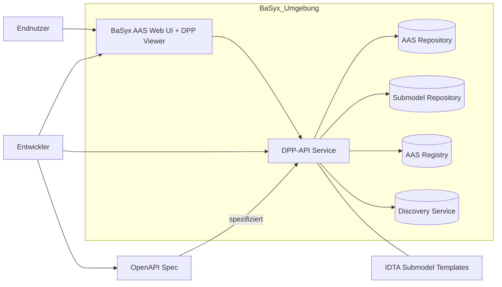
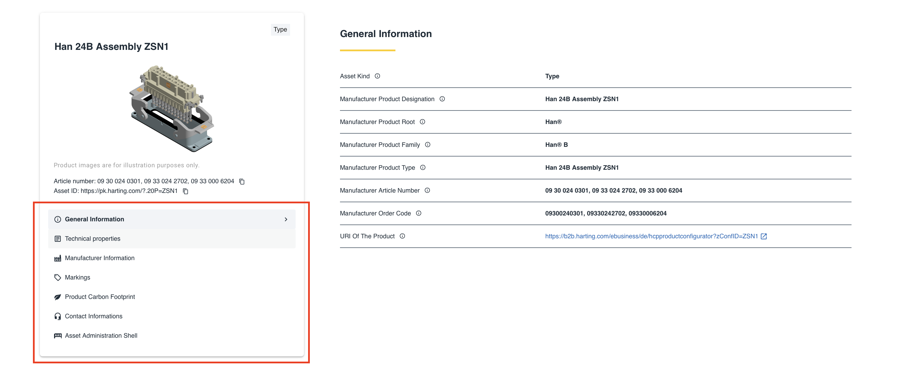
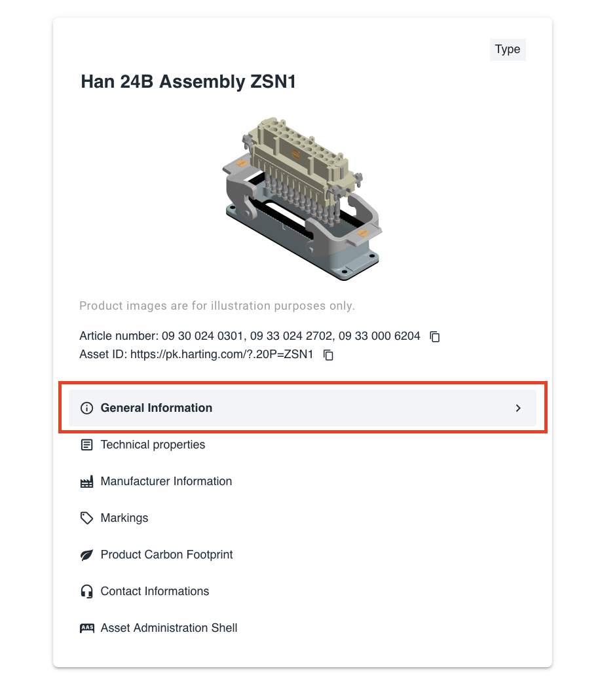
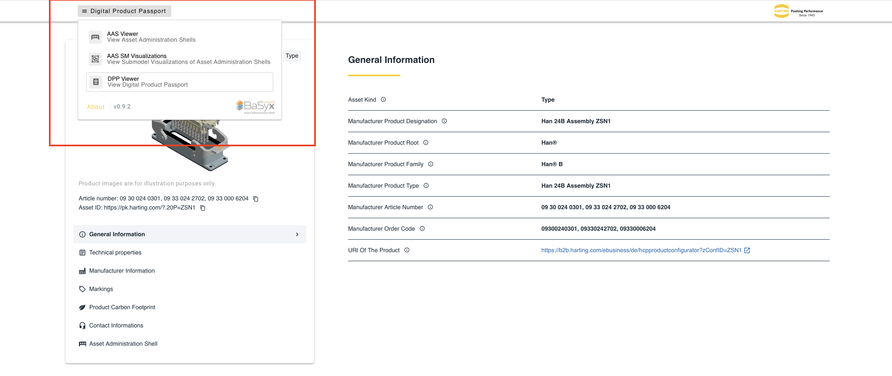
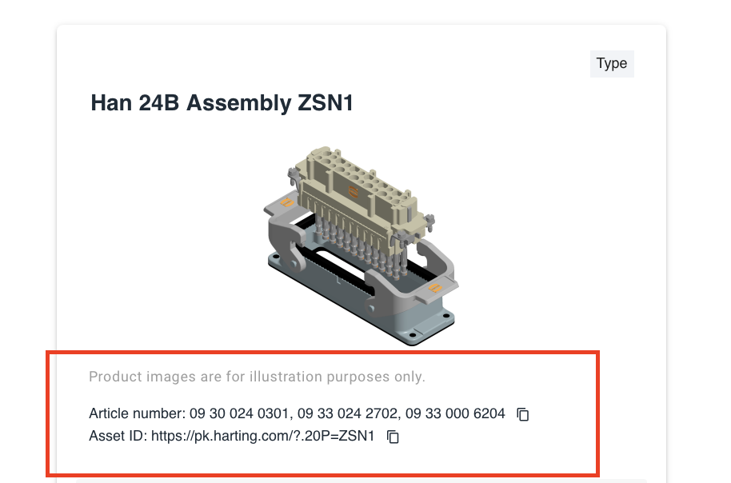
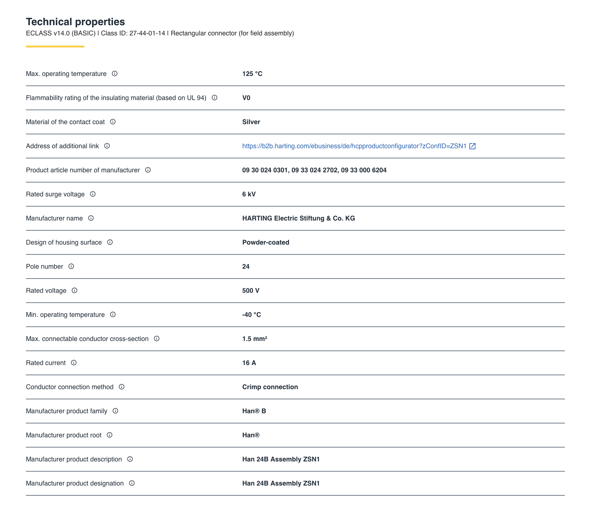
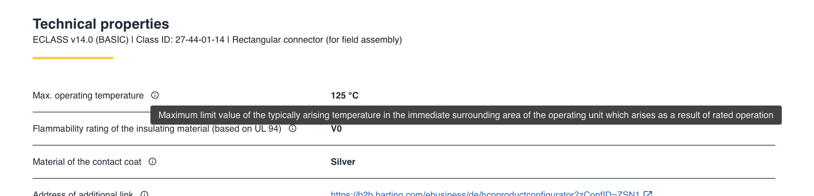
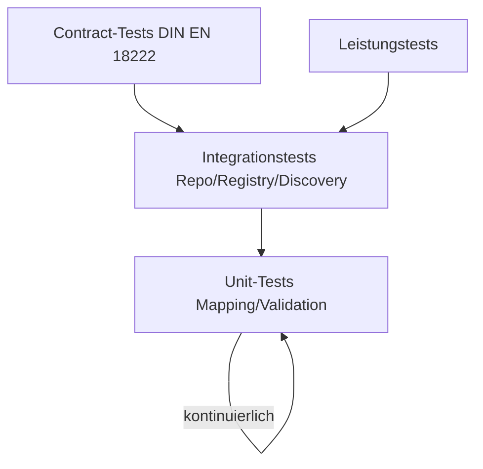

# Software Requirement Specification (SRS)

## Projekt 6: API für den Digitalen Produktpass (DPP) im BaSyx Framework

### Customer
|Name|Mail|
|---|---|
|Markus Rentschler|rentschler@lehre.dhbw-stuttgart.de|
|Pawel Wojcik|pawel.wojcik@lehre.dhbw-stuttgart.de|

---

### Aufgabenstellung
 > Die **DIN EN 18222** "Digitaler Produktpass -        Programmierschnittstellen (APIs) für das Lebenszyklusmanagement und die Durchsuchbarkeit vom Produktpass" beschreibt eine REST-API, welche im Rahmen dieser Aufgabe im BaSyx-Framework implementiert werden soll, sowohl Backend- als auch Frontendseitig. Die genaue Aufgabenstellung kann <a href="https://github.com/DHBW-TINF24F/.github/blob/main/project6_basyx_dpp_api.md">hier</a> gefunden werden.

---

### Teamaufteilung
|Name|Mail|Rolle|
|---|---|---|
|Nataliia Chubak|inf24271@lehre.dhbw-stuttgart.de |Projektleitung|
|Luca Schmoll|inf24137@lehre.dhbw-stuttgart.de|Product Owner|
|Magnus Lörcher|inf24155@lehre.dhbw-stuttgart.de|Product Owner|
|Noah Becker|inf24038@lehre.dhbw-stuttgart.de|Systemarchitekt|
|Fabian Steiß|inf24138@lehre.dhbw-stuttgart.de |Dokumentation|
|Felix Schulz|inf24075@lehre.dhbw-stuttgart.de|UI/UX Design|
|Manuel Lutz|Inf24224@lehre.dhbw-stuttgart.de|Testmanagement|

---

### Dokumenthistorie

|Version|Autor|Datum|Kommentar|
|---|---|---|---|
|1.0|Luca Schmoll|04.11.2025|Ersterstellung der Grundstruktur|

---

### Begrifflichkeiten und Abkürzungen
|Abkürzung|Bedeutung|
|---|---|
|DPP|Digitaler Produktpass|
|AAS|Asset Administration Shell|
|BaSyx|Open-Source Framework|
|Submodel|Teilstruktur eines AAS|
|OpenAPI|Industriestandard zur Beschreibung von API's|
|CRS|Customer Requirement Specification|
|SRS|Software Requirement Specification|

---

### Inhaltsverzeichnis
1. [Zweck, Geltungsbereich und Datenmodell & Semantik](#1-zweck-geltungsbereich-und-datenmodell--semantik)
    1. [Zweck](#11-zweck)
    2. [Geltungsbereich](#12-geltungsbereich)
    3. [Datenmodell und Semantik](#13-datenmodell-und-semantik)
2. [Anwendungsfälle](#2-anwendungsfälle)
3. [Funktionale Anforderungen (FR)](#3-funktionale-anforderungen-fr)
    1. [Daten und API-Anforderungen](#31-daten-und-api-anforderungen)
    2. [Frontend-Anforderungen](#32-frontend-anforderungen)
4. [Nicht-funktionale Anforderungen (NFR)](#4-nicht-funktionale-anforderungen-nfr)
5. [Usability Konzept & Workflows](#5-usability-konzept--workflows)
6. [Qualitätssicherung & Tests](#6-qualitätssicherung--tests)
7. [MockUps & Wireframes](#7-mockupswireframes)
8. [Quellen & Referenzen](#6-qualitätssicherung--tests)

---

## 1. Zweck, Geltungsbereich und Datenmodell & Semantik
### 1.1 Zweck
Dieses Dokument spezifiziert die funktionalen und nicht-funktionalen Anforderungen, die durch die Aufgabenstellung und die DIN EN 18222 vorgegeben werden und den Rahmen dieser Rest-API innerhalb der BaSyx Struktur bilden. Ziel ist eine konforme, testbare und hostbare Implementierung eines Backends und Frontends, samt OpenAPI-Spezifikation, Demoinstanz und Dokumentation.
Die primärem Ziele lassen sich wie folgt definieren:
1. Sicherstellung der **Normkonformität**
2. Nahtlose Integration ins BaSyx Framework
3. Ermöglichen des DPP Viewers im BaSyx AAS Web UI

### 1.2 Geltungsbereich
Im wesentlichen wird sich dieses Projekt auf die folgenden zwei Anwendungsbereiche beziehen:
1. **Backend**: BaSyx‑basierte Dienste (AAS Repository, Submodel Repository, Registry, Discovery) als Integrationskern; DPP‑API als Fassade zu AAS‑Strukturen.
2. **Frontend**: Erweiterung des BaSyx AAS Web UI für DPP‑spezifische Use Cases (Viewer, Suche, Routing, Visualisierung).
Die folgende Grafik dient als Übersicht der Projektstruktur und wie diese innerhalb des BaSyx Frameworks integriert werden soll.

 <i>Abbildung 1: Visuelle Übersicht des Projekts</i> 

### 1.3 Datenmodell und Semantik
Ein DPP entspricht einer AAS mit den DPP-relevanten Submodellen. Die Struktur des DPP muss durch geeignete IDTA-Submodel-Templates erfüllt werden, die grob folgenden Aufbau haben:
1. **Digital Nameplate (IDTA-02035-1):** Beinhaltet Informations und Stammdaten.
2. **Handcover Documentation (IDTA-02035-2):** Beinhaltet Dokumente und Nachweise.
3. **Product Carbon Footprint (IDTA-02035-3):** Beinhaltet Informationen über die CO2 Emission.
4. **Technical Data (IDTA-02035-4):** Beinhaltet technische Parameter.
5. **Product Condition (IDTA-02035-5):** Beinhaltet Informationen über den Zustand des Produkts.
6. **Material Composition (IDTA-02035-6):** Beinhaltet Informationen über die Zusammensetung des Produkts.
7. **Circularity (IDTA-02035-7):** Beinhaltet Informationen zur Wiederverwendbarkeit und Nachhaltigkeit.

## 2. Anwendungsfälle
Die Anwendungsfälle für diese Software können innerhalb des <a href="https://github.com/DHBW-TINF24F/Team6-BaSyx-DPP-API/blob/main/PROJECT/CRS/TINF24F_CRS_Team_6_0v1.md#use-cases">CRS</a> (Kapitel 04) gefunden werden.

## 3. Funktionale Anforderungen (FR)
Innerhalb dieses Kapitels werden die funktionalen Anforderungen an das Produkt definiert. Diese unterteilen sich in Anforderungen an das Backend (Daten und API) und Anforderungen an das Frontend.
### 3.1 Daten und API-Anforderungen

### FR-BE-01
|ID|FR-BE-01|
|---|---|
|Name|Erstellung eines DPP|
|Beschreibung|Das Backend muss in der Lage sein, einen neuen Digitalen Produktpass (DPP) entgegenzunehmen, die Gültigkeit der Datenstruktur zu prüfen und diesen innerhalb der Verwaltungsschale (AAS) im BaSyx-System zu speichern.|
|Priorität|5 - Sehr hoch|
|Akzeptanzkriterium|Ein neues referenzierendes DPP-Submodel findet sich innerhalb der AAS Shell.|

### FR-BE-02
|ID|FR-BE-02|
|---|---|
|Name|Abrufen eines DPP per ID|
|Beschreibung|Das Backend muss in der Lage sein, einen DPP anhand seiner eindeutigen dppId aus dem BaSyx-Speicher abzurufen und die vollständigen Daten im definierten Format zurückzugeben.|
|Priorität|5 - Sehr hoch|
|Akzeptanzkriterium|Die Daten des DPP mit der ID liegen vollständig vor.|

### FR-BE-03
|ID|FR-BE-03|
|---|---|
|Name|Updaten eines DPP per ID|
|Beschreibung|Das Backend muss in der Lage sein, Aktualisierungen für einen bestehenden DPP entgegenzunehmen, die Datenintegrität zu gewährleisten und die entsprechende Submodelle teilweise zu aktualisieren.|
|Priorität|5 - Sehr hoch|
|Akzeptanzkriterium|Die Daten werden aktualisiert in der Datenbank gespeichert.|

### FR-BE-04
|ID|FR-BE-04|
|---|---|
|Name|Löschen eines DPP per ID|
|Beschreibung|Das Backend muss in der Lage sein, einen DPP (Seine Submodells) anhand seiner dppId permanent aus dem BaSyx-System zu löschen.|
|Priorität|5 - Sehr hoch|
|Akzeptanzkriterium|Der DPP ist nicht mehr auffindbar in der Datenbank und im BaSyx System.|

### FR-BE-05
|ID|FR-BE-05|
|---|---|
|Name|Abrufen eines DPP per productID|
|Beschreibung|Das Backend muss in der Lage sein, den aktuellen DPP anhand der productId abzurufen. Hierfür muss eine interne Zuordnung von productId zu dppId erfolgen.|
|Priorität|5 - Sehr hoch|
|Akzeptanzkriterium|Die Daten des zu der angegebenen productId zugeordnete DPP liegt vollständig vor.|

### FR-BE-06
|ID|FR-BE-06|
|---|---|
|Name|Abrufen eines älteren DPP per Zeitstempel und productID|
|Beschreibung|Das Backend muss in der Lage sein, die historische Version eines DPP abzurufen, die zum angegebenen productId und Datum/Zeitpunkt gültig war.|
|Priorität|5 - Sehr hoch|
|Akzeptanzkriterium|Die Daten des DPP, das der angegebenen productId zugeordnet ist, liegen vollständig vor.|

### FR-BE-07
|ID|FR-BE-07|
|---|---|
|Name|Abrufen mehrerer DPPS per productID Liste|
|Beschreibung|Das Backend muss in der Lage sein, eine Liste von productIds entgegenzunehmen und eine entsprechende Liste der zugehörigen dppIds als Antwort zurückzugeben|
|Priorität|5 - Sehr hoch|
|Akzeptanzkriterium|Eine Liste an DPPS mit den entsprechenden ID's liegt vollständig vor.|

### FR-BE-08
|ID|FR-BE-08|
|---|---|
|Name|Registrierung eines DPP im AAS Registry|
|Beschreibung|Das Backend muss in der Lage sein, die Registrierung eines neuen DPP im zentralen BaSyx-Register (AAS Registry) durchzuführen.|
|Priorität|5 - Sehr hoch|
|Akzeptanzkriterium|Der DPP ist im AAS Registry auffindbar.|

### FR-BE-09
|ID|FR-BE-09|
|---|---|
|Name|Abrufen der DPP Daten eines bestimmten Submodels per dppID und elementID|
|Beschreibung|Das Backend muss in der Lage sein, eine spezifische Daten-Sammlung (Submodell-Element) eines DPP anhand der dppId und der elementId auszulesen und diese Daten zurückzugeben.|
|Priorität|5 - Sehr hoch|
|Akzeptanzkriterium|Die Daten, die unter der elementID zu finden sind, in der spezifischen DPP mit der ID liegen vor.|

### FR-BE-10
|ID|FR-BE-10|
|---|---|
|Name|Updaten der DPP Daten eines bestimmten Submodels per ID und elementID|
|Beschreibung|Das Backend muss in der Lage sein, eine spezifische Daten-Sammlung in einem DPP zu aktualisieren|
|Priorität|5 - Sehr hoch|
|Akzeptanzkriterium|Die Sammlung an Daten wurde erfolgreich innerhalb des Submodels angepasst.|

### FR-BE-11
|ID|FR-BE-11|
|---|---|
|Name|Abrufen eines Elements aus dem DPP per ID und elementPath|
|Beschreibung|Das Backend muss in der Lage sein, ein einzelnes Datenelement in einem DPP anhand eines spezifischen elementPath auszulesen.|
|Priorität|5 - Sehr hoch|
|Akzeptanzkriterium|Das abgefragte Element liegt korrekt vor.|

### FR-BE-12
|ID|FR-BE-12|
|---|---|
|Name|Updaten eines Elements aus dem DPP per ID und elementPath|
|Beschreibung|Das Backend muss in der Lage sein, ein einzelnes Datenelement in einem DPP zu aktualisieren.|
|Priorität|5 - Sehr hoch|
|Akzeptanzkriterium|Das einzelne Element wurde alleine innerhalb des DPP geupdated|

### FR-BE-13
|ID|FR-BE-13|
|---|---|
|Name|Fehler bei ungültigen Eingabeparametern|
|Beschreibung|Das Backend muss einen HTTP Error zurück geben, wenn der Nutzer falsche/ungültige Eingabeparameter verwendet.|
|Priorität|5 - Sehr hoch|
|Akzeptanzkriterium|Bei falscher Eingabe erfolgt ein HTTP Error|

### 3.2 Frontend-Anforderungen

### FR-FE-01
|ID|FR-FE-01|
|---|---|
|Name|Laden eines digitalen Produktpasses (DPP)|
|Beschreibung|Das System muss in der Lage sein, einen DPP anhand einer übermittelten AAS ID oder DPP-URL zu laden und die darin enthaltenen Submodelle anzuzeigen.|
|Priorität|5 - Sehr hoch|
|Akzeptanzkriterium|Durch Eingabe einer DPP ID bekommt man das vollständige DPP angezeigt.|

### FR-FE-02
|ID|FR-FE-02|
|---|---|
|Name|Navigation innerhalb des DPP|
|Beschreibung|Das System muss die verfügbaren Submodelle, die zum DPP gehören in einer Seitenleiste anzeigen.|
|Priorität|4 - Hoch|
|Akzeptanzkriterium|Eine Seitenleiste mit den DPP relevanten Submodellen existiert.|

### FR-FE-03
|ID|FR-FE-03|
|---|---|
|Name|Klickbare Navigation|
|Beschreibung|Durch das Klicken der Seitenleisten-Navigation müssen alle Informationen des Submodells angezeigt werden.|
|Priorität|4 - Hoch|
|Akzeptanzkriterium|Die Seitenleistenmodule sind klickbar und öffnen Informationen|

### FR-FE-04
|ID|FR-FE-04|
|---|---|
|Name|Highlighting des Submodells|
|Beschreibung|Die Kategorie, in welcher sich der Nutzer befindet, muss hervorgehoben sein.|
|Priorität|3 - Mittel|
|Akzeptanzkriterium|Ein Highlighting der aktuellen Kategorie existiert|

### FR-FE-05
|ID|FR-FE-05|
|---|---|
|Name|Menu oberhalb des Viewers|
|Beschreibung|Oberhalb des Viewers muss das Menü verfügbar sein, dass einen Wechsel zwischen DPP Viewer, AAS Viewer und Submodel Viewer möglich macht.|
|Priorität|4 - Hoch|
|Akzeptanzkriterium|Ein Menü mit Wechsel in die anderen Modi muss Verfügbar sein.|

### FR-FE-06
|ID|FR-FE-06|
|---|---|
|Name|Informationen zum Produkt|
|Beschreibung|Die productID, DPP Version und der Name des Produkts müssen im Head Bereich des Viewers stehen.|
|Priorität|3 - Mittel|
|Akzeptanzkriterium|Die Informationen sind auffindbar.|

### FR-FE-07
|ID|FR-FE-07|
|---|---|
|Name|Anzeige der einzelnen Kategorien|
|Beschreibung|Das System muss eine übersichtliche, zweispaltige Darstellung der Informationen innerhalb des einzelen Modelle bieten.|
|Priorität|5 - Sehr hoch|
|Akzeptanzkriterium|Die Informationen sind im Viewer übersichtlich verfügbar.|

### FR-FE-08
|ID|FR-FE-08|
|---|---|
|Name|Fehlende Daten|
|Beschreibung|Für fehlende Daten muss das System eine Information anzeigen.|
|Priorität|5 - Sehr hoch|
|Akzeptanzkriterium|Nicht verfügbare Daten werden markiert/angezeigt.|

### FR-FE-09
|ID|FR-FE-09|
|---|---|
|Name|Tooltipps für Daten|
|Beschreibung|Das System muss Tooltips neben den einzelnen Daten anbieten, die Informationen aus der DIN EN 18222 und den IDTA Files zur Verfügung stellen.|
|Priorität|3 - Mittel|
|Akzeptanzkriterium|Tooltips sind auffindbars|

### FR-FE-10
|ID|FR-FE-10|
|---|---|
|Name|Responsives Design|
|Beschreibung|Das System sollte auf allen gängigen Desktop und Mobilgeräten dargestellt werden können.|
|Priorität|3 - Mittel|
|Akzeptanzkriterium|Ein Mobilgerät hat eine Ansicht, eben wie ein Desktop|

## 4. Nicht-funktionale Anforderungen (NFR)

### NFR-01
|ID|NFR-01|
|---|---|
|Name|OpenAPI-Konformität|
|Beschreibung|Der Backend-Code und die Laufzeitumgebung müssen der OpenAPI-Spezifikation folgen, die aus der DIN EN 18222 abgeleitet wurde.|
|Priorität|5 - Sehr hoch|
|Akzeptanzkriterium|Die DIN EN 18222 ist auf das gesamte Projekt anwendbar|

### NFR-02
|ID|NFR-02|
|---|---|
|Name|BaSyx-Konformität|
|Beschreibung|Die Implementierung muss die von BaSyx bereitgestellten APIs und Konnektoren für die Interaktion mit der Asset Administration Shell (AAS) verwenden|
|Priorität|5 - Sehr hoch|
|Akzeptanzkriterium|Es werden nur API Calls aus dem AAS Enviroment verwendet.|

### NFR-03
|ID|NFR-03|
|---|---|
|Name|Automatisierte Tests|
|Beschreibung|Die Implementierung des DPP muss durch geeignete Unit-Tests und Integrationstests automatisiert getestet werden.|
|Priorität|4 - Hoch|
|Akzeptanzkriterium|Es gibt Unit-Tests und Integrationstests.|

## 5. Usability Konzept & Workflows
Das Usability-Konzept muss auf der Analyse des BaSyx-UI's basieren.
|Anforderung|Ziel|
|---|---|
|Ziele|Schnelle Erkennbarkeit zentraler DPP‑Informationen, klare Kontextwechsel (AAS zu Submodel), Barrierefreiheit.|
|Kern-Workflows|1. Produkt finden -> 2. AAS auswählen -> 3. DPP-Ansicht|
|Routing|Unterstützung von Teilen/Verlinken via Routing‑Deep‑Link.|
|Previews|Implementierung der Vorschau und des Downloads eingebetteter Dateien|

## 6. Qualitätssicherung & Tests
Die Qualitätssicherung für dieses Produkt muss mindestens folgendes umfassen:
|Art|Ziel|Methode|
|---|---|---|
|API-Konformität|Normtreue der Endpunkte (DIN EN 18222)|Contract-Tests|
|API-Konformität|Korrekte Abbildung der AAS Strukturen|Regelmäßige manuelle Prüfung|
|Funktionstests|Überprüfung der gesamten Use-Case‑Kette.|UC‑basierte Integrationstests.|
|Sicherheitstests|Schutz des Endpunktes|Pen-Test Szenario|
|Leistungstest|Einhaltung der Latenzzeiten|Lasttests|

Die Tests sollten dann in folgender Reihenfolge durchgeführt werden, um einen sinnvollen Workflow zu bilden:

 <i>Abbildung 5: Teststrategie</i> 

## 7. Mockups/Wireframes
Mockups und Wireframes können <a href="https://github.com/DHBW-TINF24F/Team6-BaSyx-DPP-API/tree/main/PROJECT/PM/Mockups%20%26%20Wireframes">hier</a> gefunden werden.

## 8. Quellen & Referenzen
|NR.|Referenz|Titel|Version|Beschreibung|
|---|---|---|---|---|
|1|DIN EN 18222|Digital Product Passport - Application Programming Interfaces (APIs) for the product passport lifecycle management and searchability|2025|Dokument, dass die Anforderungen an eine API für den Digitalen Produktpass enthält.|
|2|IDTA-02035-1|Digital Battery Passport - Part 1|2025|Enthält Informationen über den Tab Digital Nameplate, der innerhalb des Projekts umgesetzt wird.|
|3|IDTA-02035-5|Digital Battery Passport - Part 5|2025|Enthält Informationen über den Tab Product Condition, der innerhalb des Projekts umgesetzt wird.|
|4|IDTA-02035-2|Digital Battery Passport - Part 2|2025|Enthält Informationen über den Tab Documentation, der innerhalb des Projekts umgesetzt wird.|
|5|IDTA-02035-3|Digital Battery Passport - Part 3|2025|Enthält Informationen über den Tab Carbon Footprint, der innerhalb des Projekts umgesetzt wird.|
|6|IDTA-02035-4|Digital Battery Passport - Part 4|2025|Enthält Informationen über den Tab Technical Data, der innerhalb des Projekts umgesetzt wird.|
|7|IDTA-02035-6|Digital Battery Passport - Part 6|2025|Enthält Informationen über den Tab Material Composition, der innerhalb des Projekts umgesetzt wird.|
|8|IDTA-02035-7|Digital Battery Passport - Part 7|2025|Enthält Informationen über den Tab Circularity, der innerhalb des Projekts umgesetzt wird.|
|9|Harting|<a href="https://dpp40.harting.com:3000/dpp?aas=https://dpp40.harting.com:8081/shells/aHR0cHM6Ly9kcHA0MC5oYXJ0aW5nLmNvbS9zaGVsbHMvWlNOMQ">DPP Lösung Harting<a/>|-|Dient als Orientierung und Vorlage für eine schöne, bereits bestehende DPP Lösung.|
|10|CRS|<a href="https://github.com/DHBW-TINF24F/Team6-BaSyx-DPP-API/tree/main/PROJECT/CRS">Customer Requirement Specification</a>|2025|Wurde innerhalb dieses Projekts erstellt und dient als Grundlage fur vielerlei Themen innerhalb dieses Dokuments.|
|11|Aufgabenstellung|<a href="https://github.com/DHBW-TINF24F/.github/blob/main/project6_basyx_dpp_api.md">Team 6: BaSyx API Aufgabenstellung</a>|2025|Dient als Grundlage für dieses Projekt|
