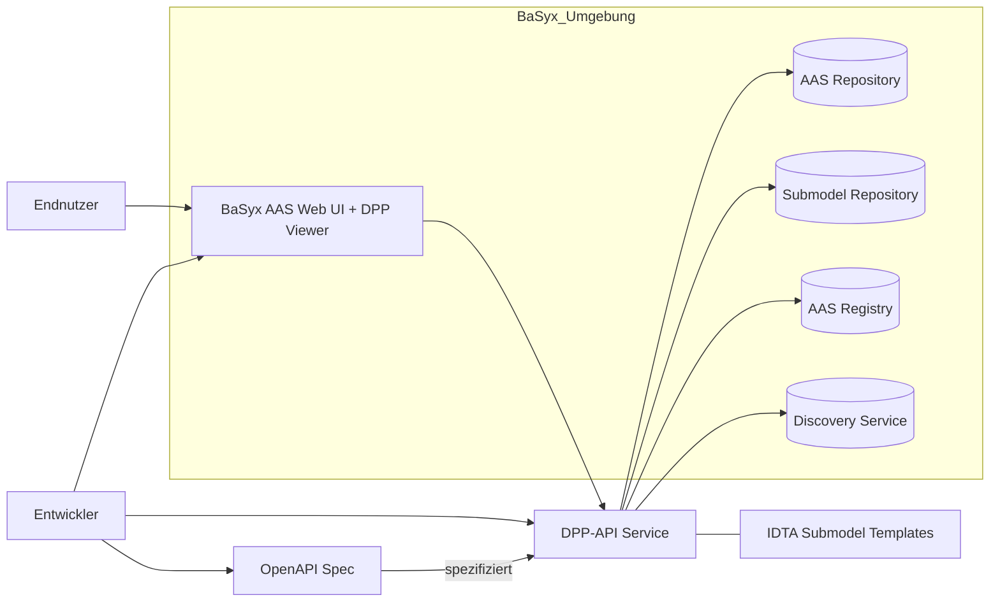
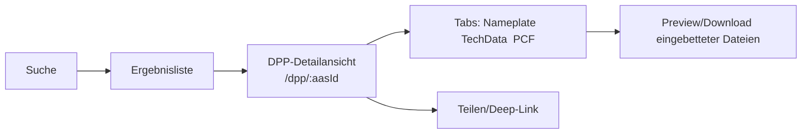
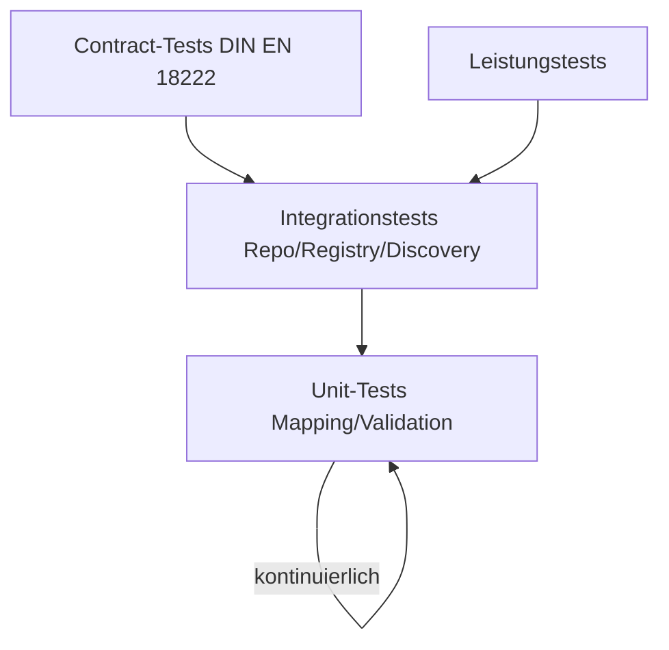

# Software Requirement Specification (SRS)

## Projekt 6: API für den Digitalen Produktpass (DPP) im BaSyx Framework

### Customer
|Name|Mail|
|---|---|
|Markus Rentschler|rentschler@lehre.dhbw-stuttgart.de|
|Pawel Wojcik|pawel.wojcik@lehre.dhbw-stuttgart.de|

---

### Aufgabenstellung
Die **DIN EN 18222** "Digitaler Produktpass - Programmierschnittstellen (APIs) für das Lebenszyklusmanagement und die Durchsuchbarkeit vom Produktpass" beschreibt eine REST-API, welche im Rahmen dieser Aufgabe im BaSyx-Framework implementiert werden soll, sowohl Backend- als auch Frontendseitig. Die genaue Aufgabenstellung kann <a href="https://github.com/DHBW-TINF24F/.github/blob/main/project6_basyx_dpp_api.md">hier</a> gefunden werden.

---

### Teamaufteilung
|Name|Mail|Rolle|
|---|---|---|
|Nataliia Chubak|inf24271@lehre.dhbw-stuttgart.de |Projektleitung|
|Luca Schmoll|inf24137@lehre.dhbw-stuttgart.de|Product Owner|
|Magnus Lörcher|inf24155@lehre.dhbw-stuttgart.de|Product Owner|
|Noah Becker|inf24038@lehre.dhbw-stuttgart.de|Systemarchitekt|
|Fabian Steiß|inf24138@lehre.dhbw-stuttgart.de |Dokumentation|
|Felix Schulz|inf24075@lehre.dhbw-stuttgart.de|UI/UX Design|
|Manuel Lutz|Inf24224@lehre.dhbw-stuttgart.de|Testmanagement|

---

### Dokumenthistorie

|Version|Autor|Datum|Kommentar|
|---|---|---|---|
|1.0|Luca Schmoll|04.11.2025|Ersterstellung der Grundstruktur|

---

### Begrifflichkeiten und Abkürzungen
|Abkürzung|Bedeutung|
|---|---|
|DPP|Digitaler Produktpass|
|AAS|Asset Administration Shell|
|BaSyx|Open-Source Framework|
|Submodel|Teilstruktur eines AAS|
|OpenAPI|Industriestandard zur Beschreibung von API's|
|CRS|Customer Requirement Specification|
|SRS|Software Requirement Specification|

---

### Inhaltsverzeichnis
1. XX
    1. XX
    2. XX
    3. XX
2. XX
    1. XX
    2. XX
    3. XX
3. XX 
    1. XX
    2. XX
    3. XX
4. XX

---

## 1. Zweck, Geltungsbereich und Referenzen
Dieses SRS Dokument wurde im Rahmen der Vorlesung "Software-Engineering" erstellt. Die Aufgabenstellung lautet, eine RestAPI auf Basis der DIN EN 18222 zu entwickeln und in das BaSyx Framework zu implementieren. 

### 1.1 Zweck
Dieses Dokument spezifiziert die funktionalen und nicht-funktionalen Anforderungen, die durch die Aufgabenstellung und die DIN EN 18222 vorgegeben werden und den Rahmen dieser Rest-API innerhalb der BaSyx Struktur bilden. Ziel ist eine konforme, testbare und hostbare Implementierung eines Backends und Frontends, samt OpenAPI-Spezifikation, Demoinstanz und Dokumentation.
Die primärem Ziele lassen sich wie folgt definieren:
1. Sicherstellung der **Normkonformität**
2. Nahtlose Integration ins BaSyx Framework
3. Ermöglichen des DPP Viewers im BaSyx AAS Web UI

### 1.2 Geltungsbereich
Im wesentlichen wird sich dieses Projekt auf die folgenden zwei Anwendungsbereiche beziehen:
1. **Backend**: BaSyx‑basierte Dienste (AAS Repository, Submodel Repository, Registry, Discovery) als Integrationskern; DPP‑API als Fassade zu AAS‑Strukturen.
2. **Frontend**: Erweiterung des BaSyx AAS Web UI für DPP‑spezifische Use Cases (Viewer, Suche, Routing, Visualisierung).
Die folgende Grafik dient als Übersicht der Projektstruktur und wie diese innerhalb des BaSyx Frameworks integriert werden soll.

 <i>Abbildung 1: Visuelle Übersicht des Projekts</i> 

### 1.3 Referenzen
Dieses Kapitel enthält Referenzen auf Dokumentationen, Quellen und Dateien, die zum Verständnis dieses SRS Dokument benötigt werden.

|NR.|Referenz|Titel|Version|Beschreibung|
|---|---|---|---|---|
|1|DIN EN 18222|Digital Product Passport - Application Programming Interfaces (APIs) for the product passport lifecycle management and searchability|2025|Dokument, dass die Anforderungen an eine API für den Digitalen Produktpass enthält.|
|2|IDTA-02035-1|Digital Battery Passport - Part 1|2025|Enthält Informationen über den Tab Digital Nameplate, der innerhalb des Projekts umgesetzt wird.|
|3|IDTA-02035-5|Digital Battery Passport - Part 5|2025|Enthält Informationen über den Tab Product Condition, der innerhalb des Projekts umgesetzt wird.|
|4|IDTA-02035-2|Digital Battery Passport - Part 2|2025|Enthält Informationen über den Tab Documentation, der innerhalb des Projekts umgesetzt wird.|
|5|IDTA-02035-3|Digital Battery Passport - Part 3|2025|Enthält Informationen über den Tab Carbon Footprint, der innerhalb des Projekts umgesetzt wird.|
|6|IDTA-02035-4|Digital Battery Passport - Part 4|2025|Enthält Informationen über den Tab Technical Data, der innerhalb des Projekts umgesetzt wird.|
|7|IDTA-02035-6|Digital Battery Passport - Part 6|2025|Enthält Informationen über den Tab Material Composition, der innerhalb des Projekts umgesetzt wird.|
|8|IDTA-02035-7|Digital Battery Passport - Part 7|2025|Enthält Informationen über den Tab Circularity, der innerhalb des Projekts umgesetzt wird.|
|9|DPP-Lösung Harting|https://dpp40.harting.com:3000/dpp?aas=https://dpp40.harting.com:8081/shells/aHR0cHM6Ly9kcHA0MC5oYXJ0aW5nLmNvbS9zaGVsbHMvWlNOMQ|-|Dient als Orientierung und Vorlage für eine schöne, bereits bestehende DPP Lösung.|
|10|CRS|Customer Requirement Specification|2025|Wurde innerhalb dieses Projekts erstellt und dient als Grundlage fur vielerlei Themen innerhalb dieses Dokuments.|

## 2. Anwendungsfälle
Die Anwendungsfälle für diese Software können innerhalb des CRS (Kapitel XX) gefunden werden.

## 3. Funktionale Anforderungen (FR)
Innerhalb dieses Kapitels werden die funktionalen Anforderungen an das Produkt definiert. Diese unterteilen sich in Anforderungen an das Backend (Daten und API) und Anforderungen an das Frontend.
### 3.1 Daten und API-Anforderungen
|ID|Name|Beschreibung|Priorität|Akzeptanzkriterium|
|---|---|---|---|---|
|FR-01|Erstellung eines DPP|Das Backend muss in der Lage sein, einen neuen Digitalen Produktpass (DPP) entgegenzunehmen, die Gültigkeit der Datenstruktur zu prüfen und diesen innerhalb der Verwaltungsschale (AAS) im BaSyx-System zu speichern.|5 - Sehr hoch|Ein neuer DPP findet sich innerhalb der AAS Shell.|
|FR-02|Abrufen eines DPP per ID|Das Backend muss in der Lage sein, einen DPP anhand seiner eindeutigen dppId aus dem BaSyx-Speicher abzurufen und die vollständigen Daten im definierten Format zurückzugeben.|5 - Sehr hoch|Die Daten des DPP mit der ID liegen vollständig vor.|
|FR-03|Updaten eines DPP per ID|Das Backend muss in der Lage sein, Aktualisierungen für einen bestehenden DPP entgegenzunehmen, die Datenintegrität zu gewährleisten und die entsprechende AAS teilweise zu aktualisieren.|5 - Sehr hoch|Die Daten werden aktualisiert in der Datenbank gespeichert.|
|FR-04|Löschen eines DPP per ID|Das Backend muss in der Lage sein, einen DPP (Seine Submodells) anhand seiner dppId permanent aus dem BaSyx-System zu löschen.|5 - Sehr hoch|Der DPP ist nicht mehr auffindbar in der Datenbank und im BaSyx System.|
|FR-05|Abrufen eines DPP per productID|Das Backend muss in der Lage sein, den aktuellen DPP anhand der productId abzurufen. Hierfür muss eine interne Zuordnung von productId zu dppId erfolgen.|5 - Sehr hoch|Die Daten eines DPP, der die angegebene productID besitzt, liegen vollständig vor.|
|FR-06|Abrufen eines älteren DPP per Zeitstempel und productID|Das Backend muss in der Lage sein, die historische Version eines DPP abzurufen, die zum angegebenen productId und Datum/Zeitpunkt gültig war.|5 - Sehr hoch|Der DPP zu dem angegeben Zeitpunkt mit der ID liegt vollständig vor.|
|FR-07|Abrufen mehrerer DPPS per productID Liste|Das Backend muss in der Lage sein, eine Liste von productIds entgegenzunehmen und eine entsprechende Liste der zugehörigen dppIds als Antwort zurückzugeben|5 - Sehr hoch|Eine Liste an DPPS mit den entsprechenden ID's liegt vollständig vor.|
|FR-08|Registrierung eines DPP im AAS Registry|Das Backend muss in der Lage sein, die Registrierung eines neuen DPP im zentralen BaSyx-Register (AAS Registry) durchzuführen.|5 - Sehr hoch|Der DPP ist im AAS Registry auffindbar.|
|FR-09|Abrufen der DPP Daten eines bestimmten Submodels per dppID und elementID|Das Backend muss in der Lage sein, eine spezifische Daten-Sammlung (Submodell-Element) eines DPP anhand der dppId und der elementId auszulesen und diese Daten zurückzugeben.|5 - Sehr hoch|Die Daten wurden entsprechend angepasst innerhalb des Submodels.|
|FR-10|Updaten der DPP Daten eines bestimmten Submodels per ID und elementID|Das Backend muss in der Lage sein, eine spezifische Daten-Sammlung in einem DPP zu aktualisieren|5 - Sehr hoch|Die Sammlung an Daten wurde erfolgreich innerhalb des Submodels angepasst.|
|FR-11|Abrufen eines Elements aus dem DPP per ID und elementPath|Das Backend muss in der Lage sein, ein einzelnes Datenelement in einem DPP anhand eines spezifischen elementPath auszulesen.|5 - Sehr hoch|Das abgefragte Element liegt korrekt vor.|
|FR-12|Updaten eines Elements aus dem DPP per ID und elementPath|Das Backend muss in der Lage sein, ein einzelnes Datenelement in einem DPP zu aktualisieren.|5 - Sehr hoch|Das einzelne Element wurde alleine innerhalb des DPP geupdated|

|FR-01|Es muss eine OpenAPI‑Spezifikation für die DPP‑API erstellt und im Repository hinterlegt werden|5 - Sehr hoch|Die Datei ist im Swagger-Editor anschaubar, bearbeitbar und ausführbar|
|FR-02|Die DPP‑API muss die in DIN EN 18222 beschriebenen Ressourcen, Operationen und Antwortcodes implementieren.|5 - Sehr hoch|Endpunkte/Parameter werden 1:1 aus dem Normtext abgeleitet und in OpenAPI abgebildet.|
|FR-03|DPP‑Operationen müssen auf AAS Endpunkte (Repository, Registry, Discovery) gemappt werden.|5 - Sehr hoch|Beispiel-Mapping: GET /dpp/{id} → AAS lesen (AAS Repository); POST /dpp → AAS/Submodel erstellen, Registrierung & Discovery-Eintrag.|
|FR-04|Volltext/Filter‑Suche über DPP‑Felder muss bereitgestellt werden; die Implementierung nutzt AAS Discovery.|4 - Mittel|Suche liefert Ergebnisse in unter 800 ms (NFR-03); Filterung nach mindestens zwei Attributen (z.B. Hersteller, Submodel-Name) ist möglich.|
|FR-05|Die API muss DPP‑Daten als JSON exportieren|4 - Mittel|Exportiere Dateien sind validierbar|
|FR-06|Mindestens drei Beispiel‑AAS mit DPP‑Submodellen (basierend auf IDTA-Vorlagen wie Nameplate, TechData, PCF) müssen geladen werden.|5 - Sehr hoch|Drei eigenständige AAS-Dateien existieren und sind im Demo-System registriert.|
### 3.2 Frontend-Anforderungen
|ID|Anforderung|Priorität|Kriterium|
|---|---|---|---|
|FR-07|Das BaSyx AAS Web UI muss einen DPP‑Viewer bereitstellen, der Submodel‑spezifische Ansichten (Nameplate/TechData/PCF) mit Previews und Routing‑Deep‑Links unterstützt.|5 - Sehr hoch|Ein Deep-Link (URL) zur DPP-Ansicht eines spezifischen Assets funktioniert und die Submodel-Daten werden strukturiert und nutzerfreundlich angezeigt|
|FR-08|Eine strukturierte Online‑Benutzerdoku (How‑to, Screenshots, API‑Referenz) muss im BaSyx‑Wiki/GitHub verlinkt werden.|4 - Mittel|Doku ist über das BaSyx-Wiki zugänglich und enthält Anleitungen für alle UC-01 bis UC-04.|
|FR-09|Die lokale Buildchain (Forken, Kompilieren, lokale Ausführung) muss etabliert sein.|5 - Sehr hoch|Eine minimale Code-Änderung (z.B. im UI-Titel) ist nach lokalem Build und Neustart des Docker-Stacks sichtbar.|

## 4. Nicht-funktionale Anforderungen (NFR)
|ID|Anforderung|Priorität|Kriterium|
|---|---|---|---|
|NFR-01|p95 Lesezugriffe < 300 ms bei 100 gleichzeitigen Requests.|4 - Mittel|Lasttestprotokoll weist eine Latenz unter 300 ms für 95% der Abfragen nach.|
|NFR-02|Suche p95 < 800 ms bei Index‑Treffer ≤ 10 k.|3 - Niedrig|Messung der Suchlatenz im Demo-Betrieb.|
|NFR-03|Containerisierte Bereitstellung via Docker Compose ist zwingend notwendig.|5 - Sehr hoch|Das gesamte Projekt ist über einen einzelnen Docker Befehl deploybar|
|NFR-04|Unterstützung BaSyx V2 und AAS V3 (insbesondere UI‑Kompatibilität und API‑Profile).|4 - Mittel|DPP-Daten, die AAS V2 oder V3 entsprechen, werden vom Viewer korrekt verarbeitet.|
|NFR-05|Das Projekt wird auf einem Public Server gehostet und ist darüber abrufbar und nutzbar.|4 - Sehr hoch|Das Projekt ist abrufbar über das Web.|

## 7. Datenmodell und Semantik
Ein DPP entspricht einer AAS mit den DPP-relevanten Submodellen. Die Struktur des DPP muss durch geeignete IDTA-Submodel-Templates erfüllt werden, die grob folgenden Aufbau haben:
1. **Digital Nameplate (IDTA-02035-1):** Beinhaltet Informations und Stammdaten.
2. **Handcover Documentation (IDTA-02035-2):** Beinhaltet Dokumente und Nachweise.
3. **Product Carbon Footprint (IDTA-02035-3):** Beinhaltet Informationen über die CO2 Emission.
4. **Technical Data (IDTA-02035-4):** Beinhaltet technische Parameter.
5. **Product Condition (IDTA-02035-5):** Beinhaltet Informationen über den Zustand des Produkts.
6. **Material Composition (IDTA-02035-6):** Beinhaltet Informationen über die Zusammensetung des Produkts.
7. **Circularity (IDTA-02035-7):** Beinhaltet Informationen zur Wiederverwendbarkeit und Nachhaltigkeit.

## 8. Usability Konzept & Workflows
Das Usability-Konzept muss auf der Analyse des BaSyx-UI's basieren.
|Anforderung|Ziel|
|---|---|
|Ziele|Schnelle Erkennbarkeit zentraler DPP‑Informationen, klare Kontextwechsel (AAS zu Submodel), Barrierefreiheit.|
|Kern-Workflows|1. Produkt finden -> 2. AAS auswählen -> 3. DPP-Ansicht|
|Routing|Unterstützung von Teilen/Verlinken via Routing‑Deep‑Link.|
|Previews|Implementierung der Vorschau und des Downloads eingebetteter Dateien|

Grafisch modelliert könnte der Kern-Workflow wie folgt aussehen:

 <i>Abbildung 4: Workflow für das Suchen eines DPP</i> 

## 9. Qualitätssicherung & Tests
Die Qualitätssicherung für dieses Produkt muss mindestens folgendes umfassen:
|Art|Ziel|Methode|
|---|---|---|
|API-Konformität|Normtreue der Endpunkte (DIN EN 18222)|Contract-Tests|
|API-Konformität|Korrekte Abbildung der AAS Strukturen|Regelmäßige manuelle Prüfung|
|Funktionstests|Überprüfung der gesamten Use-Case‑Kette.|UC‑basierte Integrationstests.|
|Sicherheitstests|Schutz des Endpunktes|Pen-Test Szenario|
|Leistungstest|Einhaltung der Latenzzeiten|Lasttests|

Die Tests sollten dann in folgender Reihenfolge durchgeführt werden, um einen sinnvollen Workflow zu bilden:

 <i>Abbildung 5: Teststrategie</i> 

## 10. Quellen
