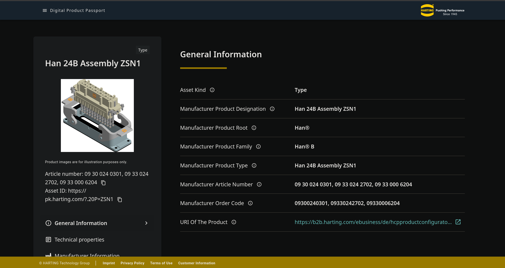

 [](https://github.com/DHBW-TINF24F/Team6-BaSyx-DPP-API/actions/workflows/deploy_frontend.yml) [](https://github.com/DHBW-TINF24F/Team6-BaSyx-DPP-API/actions/workflows/deploy_backend.yml) [](https://github.com/DHBW-TINF24F/Team6-BaSyx-DPP-API/actions/workflows/deploy_swagger.yml)

# TINF24F_Team6_BaSyx_DPP_API

<p align="center">
  <a href="https://srv01.noah-becker.de/uni/swe/swagger/">Swagger</a> &bull;
  <a href="https://srv01.noah-becker.de/uni/swe/basyx/">BaSyx Web UI</a> &bull;
  <a href="https://github.com/DHBW-TINF24F/Team6-BaSyx-DPP-API/tree/main/PROJECT/MEETING_PROTOCOLS">Meeting Minutes</a> &bull;
  <a href="https://github.com/DHBW-TINF24F/Team6-BaSyx-DPP-API/blob/main/PROJECT/PRESENTATION/Team%206%20BaSyx%20DPP%20API.pptx">Presentation</a>
</p>

<hr>

<p align="center">
  
  &nbsp;&nbsp;&nbsp;&nbsp;
  
</p>

<br>



<br>

---

## Table of Contents
1. [Project Description](#project-description)
2. [Architecture](#architecture)
3. [Frontend Screenshots](#frontend-screenshots)
4. [Main Tasks](#main-tasks)
5. [Team Members](#team-members)
6. [Technologies & Tools](#technologies--tools)
7. [Documentation](#documentation)
8. [Useful Links](#useful-links)

---

## Project Description

**Digital Product Passports (DPP)** are becoming a central requirement for transparent, sustainable and circular product lifecycles - driven by the EU Ecodesign for Sustainable Products Regulation (ESPR) and standardized through **DIN EN 18222**.

This project implements a **REST API for the Digital Product Passport** according to the DIN EN 18222 draft standard and integrates it into the **Eclipse BaSyx** framework.

### Why this solution exists

Before this project, there was **no standardized, BaSyx-native API** for serving Digital Product Passports in a DIN EN 18222 compliant way. Manufacturers and users had to manually map Asset Administration Shell (AAS) data to the required DPP format or rely on proprietary solutions. This led to inconsistent implementations, limited interoperability, and higher integration effort.

### What we improved

Our solution provides a clean, standardized REST API that:
- Calls existing BaSyx services (especially the AAS Repository API)
- Maps the responses automatically to the DIN EN 18222 compliant format
- Makes DPP data directly accessible and searchable via a well-defined interface
- Includes a modern, independent **DPP Viewer** frontend integrated into the BaSyx Web UI

The result is a production-ready building block that can be packaged as a new “BaSyx DPP” Docker container for the community.

---

## Architecture

The system follows a microservices (Docker) architecture, structured from general to specific:
```
End User / Developer
       │
       ▼
  Traefik (Reverse Proxy, HTTPS)
       │
  ┌────┴────┐
  │         │
Frontend  DPP API (Backend)
(Vue.js)  (Spring Boot)
              │
              ▼
      BaSyx Environment API
      (AAS Repository, Submodel Repository,
       AAS Registry, Discovery Service)
              │
              ▼
          MongoDB
```

text| Layer | Technology | Purpose |
|-------|------------|---------|
| Presentation | Vue.js | User interface, DPP Viewer |
| Application | Spring Boot (Java) | Business logic, REST API |
| Data | MongoDB via BaSyx | Persistent AAS/Submodel storage |
| Infrastructure | Traefik, Docker, GitHub Actions | Routing, deployment, CI/CD |

For the full architectural specification, see the [SAS (Software Architecture Specification)](./PROJECT/SAS/TIN24F_SAS_Team_6_0v1.md).

---

## Frontend Screenshots

<!-- TODO: Add screenshots -->
> 📸 *Screenshots will be added here.*

---

## Main Tasks

1. **OpenAPI Specification**
   - [x] Derive a complete OpenAPI (Swagger) specification from [DIN EN 18222](https://www.dinmedia.de/en/draft-standard/din-en-18222/393321021)
   - [x] Ensure compliance and interoperability with BaSyx REST standards
2. **BaSyx Environment Setup**
   - [x] Install and configure a local BaSyx environment
3. **UI Analysis & Design**
   - [x] Analyze existing BaSyx and DPP UI solutions
   - [x] Define designs for the API frontend
4. **Development & Integration**
   - [x] Fork and modify required BaSyx repositories
   - [ ] Implement and test DPP API and UI components
5. **Deployment & Documentation**
   - [x] Host the DPP API and frontend on a public demo server
   - [x] Provide structured online documentation via GitHub Pages or BaSyx Wiki
   - [ ] Present the implementation for community acceptance in the BaSyx open-source project *(currently in discussion)*

---

## Team Members

| Role | Responsible Person |
|------|--------------------|
| Project Manager | Nataliia Chubak |
| Product Manager | Luca Schmoll, Magnus Lörcher |
| Test Manager | Manuel Lutz |
| System Architect | Noah Becker |
| Documentation | Fabian Steiß |
| UI Designer | Felix Schulz |
| Developer | All |

---

## Technologies & Tools

| Component | Technology |
|-----------|------------|
| **Backend** | Java / Spring Boot (BaSyx SDK) |
| **Frontend** | Vue.js (BaSyx UI) |
| **Infrastructure** | Eclipse BaSyx Framework |
| **API Definition** | OpenAPI 3.0 / Swagger |
| **Data Model** | Asset Administration Shell (AAS) |
| **Hosting** | Traefik (Reverse Proxy) & Docker - [Swagger](https://srv01.noah-becker.de/uni/swe/swagger/) · [BaSyx WebUI](https://srv01.noah-becker.de/uni/swe/basyx/) |
| **Documentation** | Markdown, GitHub Wiki, Swagger UI |

---

## Documentation

An overview of all project documents. The documents are cross-linked: the SRS references the CRS (use cases), the SAS references the SRS (requirements), and the User Documentation builds on the implemented frontend.

| Document | Description | Link |
|----------|-------------|------|
| **SRS** - Software Requirements Specification | Functional & non-functional requirements | [SRS](./PROJECT/SRS/SRS.md) |
| **SAS** - Software Architecture Specification | System architecture, diagrams, technical concepts | [SAS](./PROJECT/SAS/TIN24F_SAS_Team_6_0v1.md) |
| **CRS** - Customer Requirements Specification | Customer requirements & use cases | [CRS](./PROJECT/CRS/crs.md) |
| **MOD** - Module Documentation | Module descriptions & interfaces | [MOD](./PROJECT/MOD/) |
| **User Manual** | End-user guide for the DPP Viewer | [User Manual](./PROJECT/USER_MANUAL/usermanual.md) |
| **Developer README** | Setup, local development, backend & frontend | [dev README](./README.dev.md) |
| **Meeting Protocols** | All project meeting minutes | [Meeting Protocols](./PROJECT/MEETING_PROTOCOLS/) |
| **Presentation** | Final project presentation | [PowerPoint](./PROJECT/PRESENTATION/Team%206%20BaSyx%20DPP%20API.pptx) |
| **Swagger / OpenAPI** | Live API documentation (DIN EN 18222) | [Swagger UI](https://srv01.noah-becker.de/uni/swe/swagger/) |

---

## Useful Links

- [BaSyx Hack - Useful API information](https://basyxhack.iese.de/docs.html#gettingstarted)
- [AAS Web UI overview](https://wiki.basyx.org/en/latest/content/user_documentation/basyx_components/web_ui/index.html)
- [DIN EN 18222](https://www.dinmedia.de/en/draft-standard/din-en-18222/393321021)
- [Tutorials & Resources](https://github.com/DHBW-TINF24F/.github/blob/main/Tutorials.md)
- [Open Issues](https://github.com/DHBW-TINF24F/Team6-BaSyx-DPP-API/issues)
- [Roadmap](https://github.com/orgs/DHBW-TINF24F/projects/9)

---

## Version History

- **1.3** (current) - Landing README improvements and User Manual - *iFabse*
- **1.2** (24.04.2026) - Updated WIP badge with build and deploy badges - *noahdbecker*
- **1.1.1** (12.04.2026) - General README update - *mrentsch65*
- **1.1** (31.03.2026) - README improvements - *iFabse*
- **1.0.3** (25.03.2026) - Added dev README and linked it in main README - *noahdbecker*
- **1.0.2** (20.03.2026) - Fixes and pictures added to README - *iFabse*
- **1.0.1** (21.11.2025) - Various README updates and PowerPoint link fix - *iFabse*
- **1.0** (05.11.2025) - Initial structured version with checklist and cleanup - *Fabian Steiß*